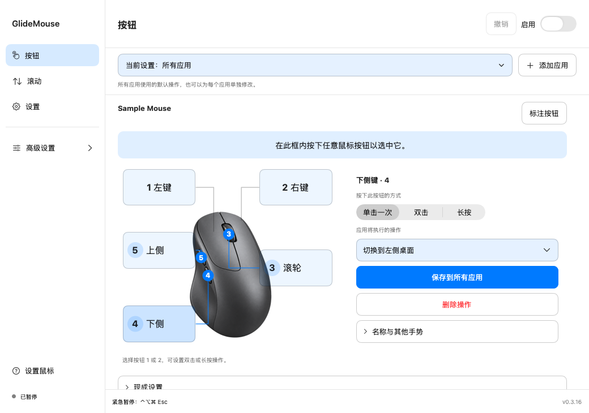
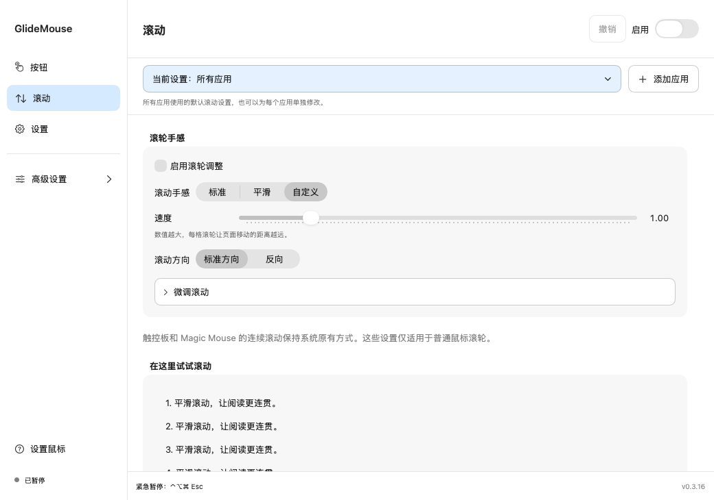
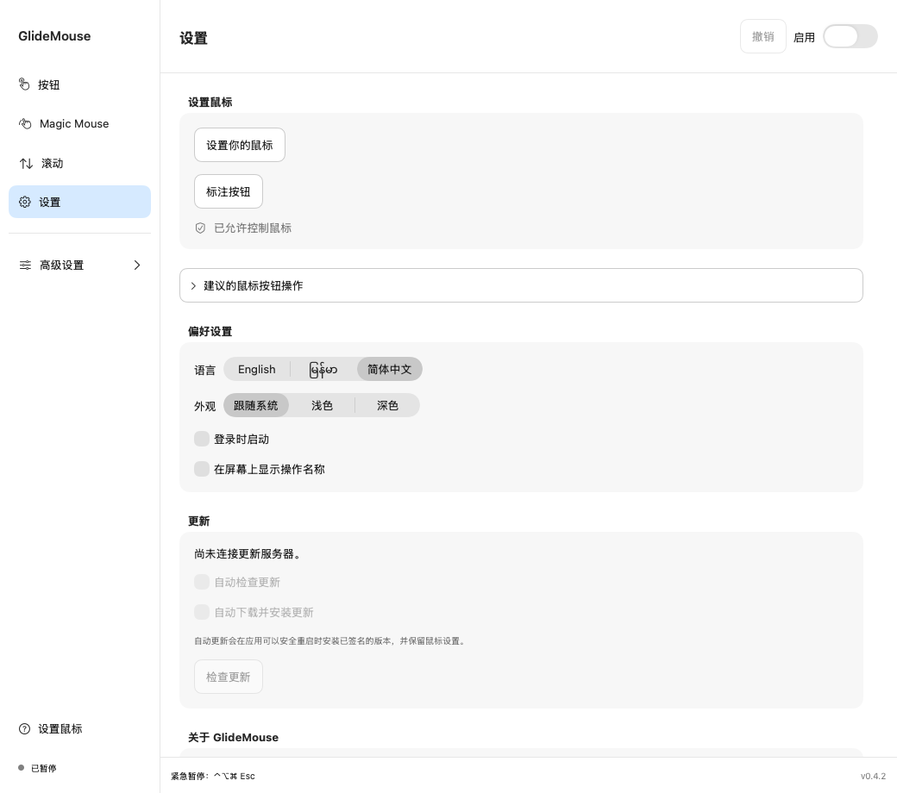

# GlideMouse 使用说明

设置鼠标按钮操作、调整滚轮手感，并在不同应用中使用不同的操作。支持 macOS 14 或更新版本、Apple Silicon 和 Intel。

**[网站](https://minnkhantthuu.github.io/GlideMouse/?lang=zh) · [English](../README.md) · [မြန်မာ](../README_MM.md)**

**[下载 DMG](https://github.com/MinnKhantThuu/GlideMouse/releases/download/v0.4.2/GlideMouse-0.4.2.dmg)**。本指南及图片展示 0.4.2；可用安装包见[发布列表](https://github.com/MinnKhantThuu/GlideMouse/releases)。

## 安装与授权

打开 DMG，将 GlideMouse 拖入 Applications。退出旧版后，从 Applications 打开新版，无需 Xcode。进入“设置鼠标”，允许辅助功能和输入监控，再返回应用刷新。必要时重新打开应用。

辅助功能用于执行你选定的操作，输入监控用于识别按钮和滚轮。设置保存在本机，不记录键入的文字。更新检查会连接更新服务器；你选择的网站或自动化操作可能连接其目标。

在“设置”中选择“简体中文”，语言切换不会改变鼠标操作。

## 添加按钮操作

1. 打开“按钮”，先保留“所有应用”范围。
2. 点击“添加按钮操作”。
3. 在捕获区域按下鼠标按钮，或从列表选择按钮编号。
4. 选择单击、双击或长按，再选择操作。
5. 普通操作自动保存；快捷键和带目标的操作需在详情窗口完成后点击保存。
6. 启用 GlideMouse，在捕获区域外试用。

每一行显示鼠标图标、编号、按下方式、操作选择器、删除按钮和更多菜单。选择器整个矩形均可点击。按钮编号无法直接说明物理位置，需要时展开“在鼠标上查找按钮”，捕获并确认滚轮/侧键的位置。

| 示例输入 | 操作 |
|---|---|
| 下方侧键单击 | 左侧桌面 |
| 上方侧键单击 | 右侧桌面 |
| 下方侧键长按 | 调度中心 |

使用你自己的按钮编号。切换桌面需要多个 macOS 空间，并启用 Control–左/右快捷键。无法切换时先从键盘测试。

左侧“双击”是你按按钮的方式，操作列表中的“执行左键双击”则是应用发送的操作。侧键单击可以触发左键双击。按钮 1 和 2 支持双击/长按，保留普通点击和拖动；双击绑定会增加区分单击与双击的短暂等待。

## 修改、删除与撤销

直接点击某一行的操作选择器，搜索并选择另一操作，自动保存。点击该行的垃圾桶只删除这一种输入，不会同时删除长按或双击。误操作可撤销。“…”菜单提供详情、高级映射，以及将应用专属操作重置为默认操作。

“增大音量”和“减小音量”分别调整音量；“静音 / 取消静音”切换静音。“搜索 App（聚焦）”打开聚焦搜索，“打开截屏工具”打开 macOS 截屏工具栏。

## 按应用设置

“所有应用”提供默认操作。只有需要不同操作时才添加应用。

1. 点击“添加应用”，选择已安装的应用。
2. 确认顶部范围显示该应用。
3. 修改对应行，自动保存为该应用的专属操作。
4. 将该应用置于前台后试用。

“来自所有应用”表示继承默认；选择另一操作会变成该应用的自定义操作。未修改的输入继续使用默认。比如侧键通常切换桌面，而 Safari 位于前台时执行后退。

选择应用并点击“移除应用”只移除 GlideMouse 配置，不会卸载应用。默认操作恢复生效，可撤销。继承行不能当作本应用自己的操作删除；要移除默认需切换到“所有应用”，或为当前应用选择自定义操作。

## 滚动

先选标准或平滑，再调整速度与方向。需要时展开细调。

| 设置 | 含义 |
|---|---|
| 速度 | 每格滚轮移动的距离 |
| 方向 | 正常或反向 |
| 平滑度 | 将每格滚轮的移动逐渐展开 |
| 惯性 | 停止滚轮后继续短暂移动 |
| 加速 | 快速转动时移动更远；零表示不加速 |
| Shift + 滚轮 | 水平滚动 |
| Control + 滚轮 | 精细滚动 |
| Option + 滚轮 | 使用当前应用的缩放快捷键 |

应用专属滚动需先启用“在此应用中使用不同的滚动设置”，否则继承默认。触控板和 Magic Mouse 原生连续滚动保持原样。

## 快捷键、设置与帮助

选择键盘快捷键操作，聚焦录制框，按下组合键，然后保存。先确认快捷键在目标应用中有效。捕获区域外的现有映射继续工作。

高级映射提供按住并移动、按住并滚动及修饰键组合。高级标题的文字和空白区域均可点击展开/收起。

设置中可更改语言、外观、登录启动及动作提示，导入/导出备份。建议按钮操作是可选的折叠区域，查看不会自动添加；先预览再应用。更新来自签名发布源，源码提交不会直接更新安装的应用。Store 版本由 App Store 更新。

“按钮”页面的问号打开离线动画指南，[网站](https://minnkhantthuu.github.io/GlideMouse/?lang=zh#mouse-guide)也有示例。观看不会执行操作或修改设置。概览视频使用示例界面、英文文字和原创音乐；旧教程展示较早版本。

紧急暂停：**Control + Option + Command + Escape**。也可从菜单栏暂停。Help → 排查问题可检查权限，技术详情默认收起。分享诊断前请检查内容，不要公开私密文件或凭据。

## 兼容性与版本

直接下载版提供实验性 Magic Mouse 手势设置，但尚待真实 Magic Mouse 验证。原生连续桌面滑动、放大手势及智能缩放不可用，也不能按不同鼠标分别设置普通按钮/滚轮。[兼容说明](COMPATIBILITY.md) · [Magic Mouse 设置](guides/MAGIC_MOUSE.md)。

沙盒 Store 版保留普通按钮、单击/双击/长按、快捷键、桌面/调度中心操作、滚轮、URL 和按应用设置；不包含私有触控手势、媒体/亮度注入、命令、应用/文件夹目标、Sparkle 和捐赠按钮。[Store 说明](MAC_APP_STORE.md)。

开发者 **Minn Khant Thu** · [网站](https://minnkhantthu.up.railway.app/) · [邮件](mailto:minnkhantthu.ucsy@gmail.com) · [Buy Me a Coffee](https://buymeacoffee.com/minnkhantthu)
