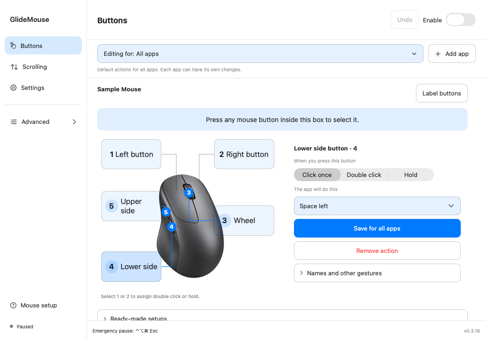
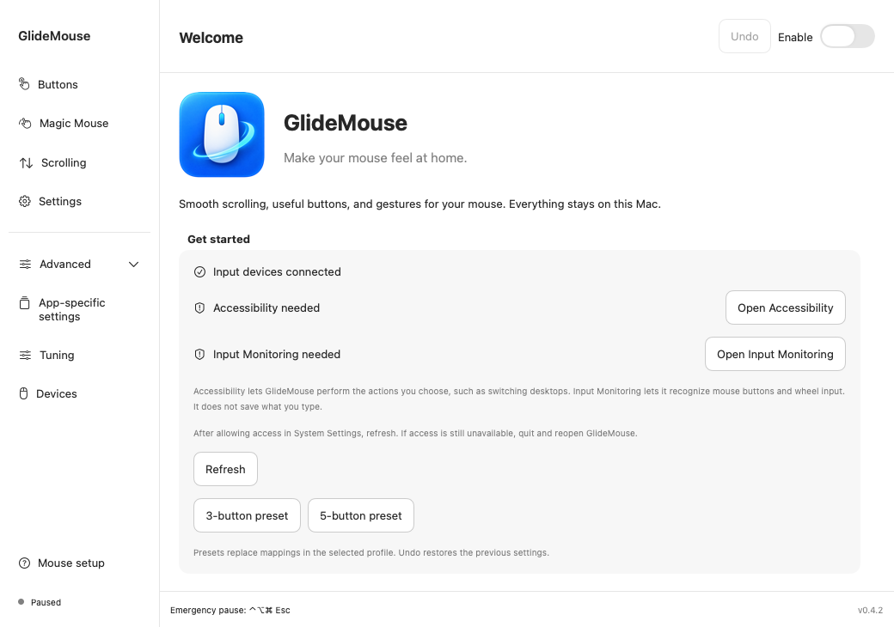
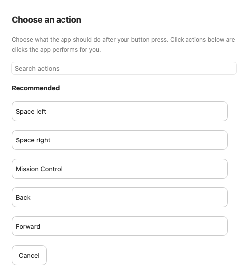
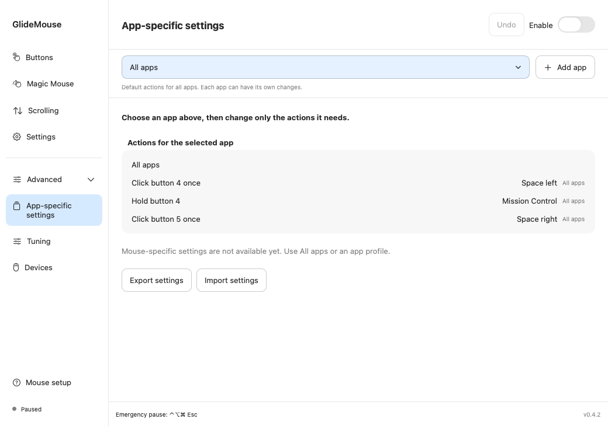
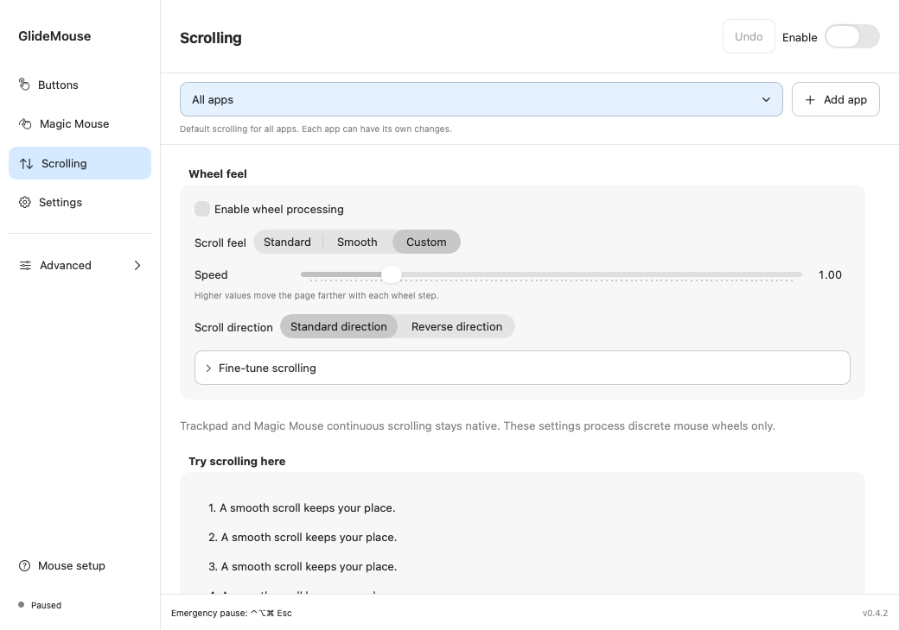
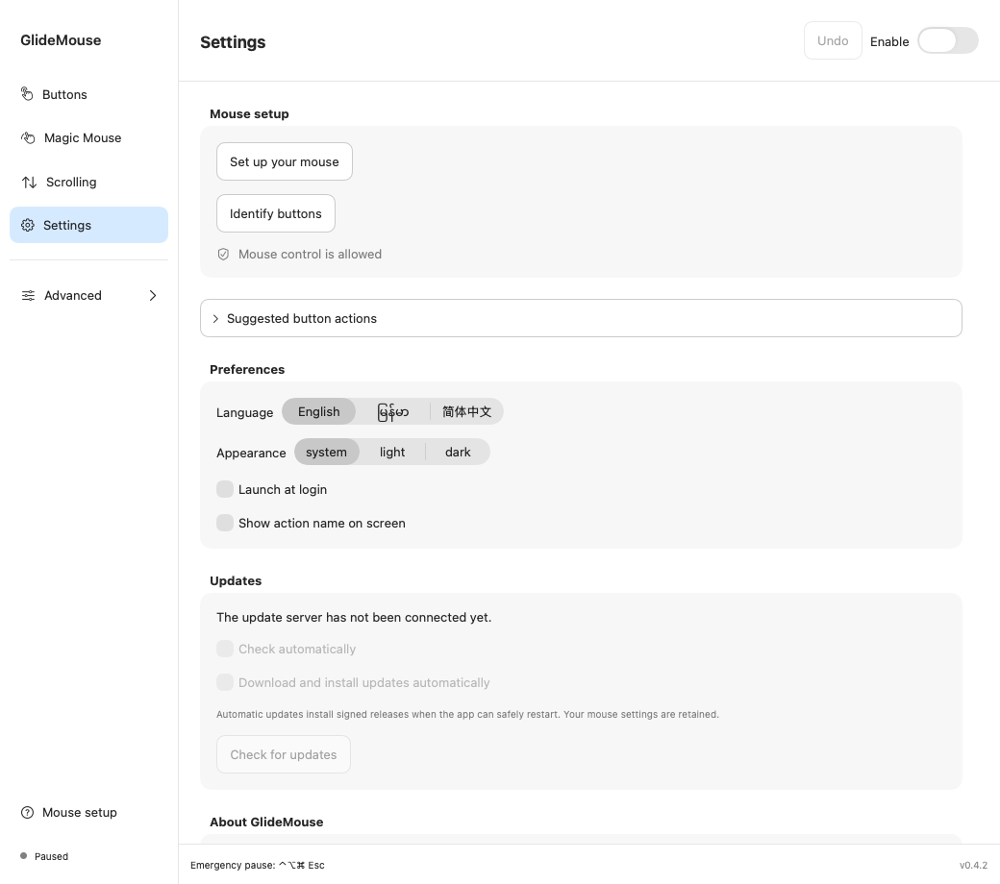
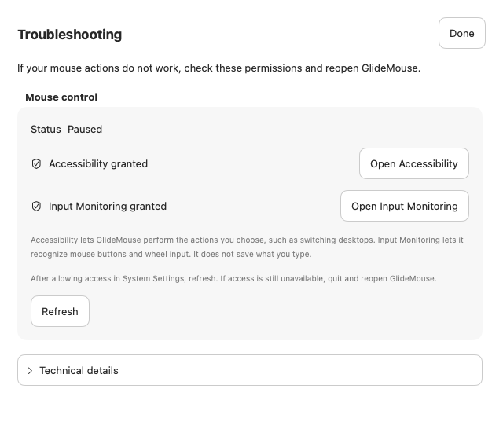
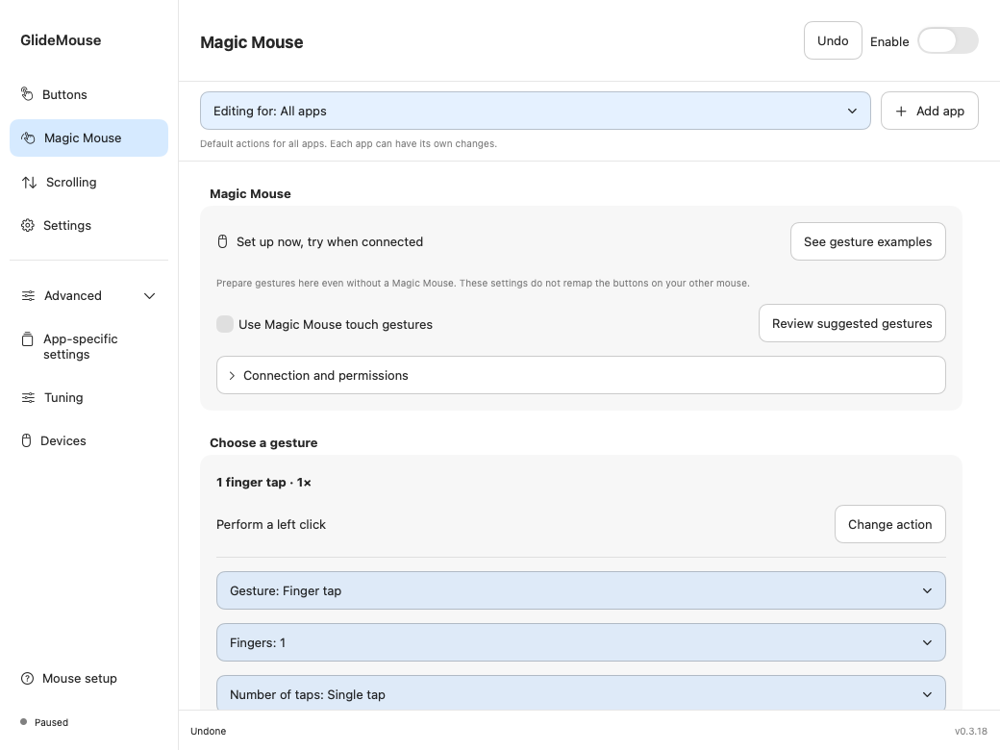

# GlideMouse

Make your mouse buttons useful and your scrolling comfortable on macOS. GlideMouse is a native SwiftUI app by **Minn Khant Thu**, with English, Myanmar and Simplified Chinese interfaces.

**[Website](https://minnkhantthuu.github.io/GlideMouse/) · [မြန်မာလမ်းညွှန်](README_MM.md) · [Watch the tutorials](https://minnkhantthuu.github.io/GlideMouse/tutorials.html) · [简体中文](Docs/USER_GUIDE_ZH.md)**

**[Download GlideMouse for macOS — DMG, v0.3.19](https://github.com/MinnKhantThuu/GlideMouse/releases/download/v0.3.19/GlideMouse-0.3.19-developer.dmg)**

Download → drag GlideMouse to Applications → open and allow permissions → set your mouse actions. No Xcode or build commands needed.

## What it does

- Set separate **single-click, double-click and hold** actions for wheel and side buttons.
- Set deliberate **double-click and hold** actions for left/right buttons; retain normal clicks and dragging.
- Switch desktops, show Mission Control, navigate back/forward, control media, run a keyboard shortcut or open an app, folder or website.
- Adjust mouse-wheel speed, direction, smoothing, momentum and acceleration.
- Use default settings in **All apps**, with optional changes for individual apps.
- Capture a button to identify its number, then label its physical position on the mouse picture.
- Remove actions or app setups, Undo changes, and export/import settings.
- Launch at login, choose an appearance, check for updates and pause quickly from the menu bar.

Core mouse control works locally. The app does not keep a log of what you type. Signed-update checks contact the configured update host. Websites, apps and commands open only when you choose an action that uses them.

## Install and first launch

**Requirements:** macOS 14 or later; Apple Silicon or Intel. A standard USB/Bluetooth mouse with a wheel or side buttons is recommended. The universal build contains both architectures; that does not mean every Mac, OS version or mouse has been physically tested.

1. **[Download the DMG](https://github.com/MinnKhantThuu/GlideMouse/releases/download/v0.3.19/GlideMouse-0.3.19-developer.dmg)**.
2. Quit an older GlideMouse copy. Double-click the downloaded DMG, then drag **GlideMouse** onto **Applications** in the window.
3. Open GlideMouse from Applications and complete **Mouse setup**. You can eject the GlideMouse disk after copying the app.
4. Allow the two permissions below, return to the app and click **Refresh**. Reopen GlideMouse if macOS has not applied the permissions yet.
5. Identify your buttons, save an action, then enable GlideMouse. Test one button at a time.

Install GlideMouse in Applications before granting permissions. [Apple’s first-launch guide](https://support.apple.com/102445) explains the macOS app-opening controls.

### Why the permissions are needed

| Permission | Purpose | Where to allow it |
|---|---|---|
| Accessibility | Perform your selected actions, such as changing desktops or sending a shortcut | System Settings → Privacy & Security → Accessibility |
| Input Monitoring | Recognize mouse buttons and wheel input | System Settings → Privacy & Security → Input Monitoring |

GlideMouse cannot work fully without these permissions. This does not give it a reason to save typed text, screenshots or device serial numbers. Diagnostic export is optional; review an export before sharing it.

## Video lessons

Optional: watch these short lessons if you want a walkthrough. English videos have narration; Myanmar videos use captions. They demonstrate the app with sample settings, rather than recording physical mouse presses or actual desktop switching.

| Lesson | English | မြန်မာ | What you learn |
|---|---|---|---|
| 1. Start and identify buttons | [Watch](https://minnkhantthuu.github.io/GlideMouse/tutorials.html#en-setup) | [ကြည့်ရန်](https://minnkhantthuu.github.io/GlideMouse/tutorials.html#my-setup) | Permissions, button numbers, positions and starter setup |
| 2. Click, double click, hold | [Watch](https://minnkhantthuu.github.io/GlideMouse/tutorials.html#en-buttons) | [ကြည့်ရန်](https://minnkhantthuu.github.io/GlideMouse/tutorials.html#my-buttons) | Desktop left/right, Mission Control and primary buttons |
| 3. One app, different actions | [Watch](https://minnkhantthuu.github.io/GlideMouse/tutorials.html#en-profiles) | [ကြည့်ရန်](https://minnkhantthuu.github.io/GlideMouse/tutorials.html#my-profiles) | Inheritance, save scope, remove app and Undo |
| 4. Scrolling and settings | [Watch](https://minnkhantthuu.github.io/GlideMouse/tutorials.html#en-scrolling) | [ကြည့်ရန်](https://minnkhantthuu.github.io/GlideMouse/tutorials.html#my-scrolling) | Speed, direction, response, language and About |
| 5. Shortcuts, delete and help | [Watch](https://minnkhantthuu.github.io/GlideMouse/tutorials.html#en-shortcuts) | [ကြည့်ရန်](https://minnkhantthuu.github.io/GlideMouse/tutorials.html#my-shortcuts) | Shortcut recording, delete, Undo and emergency pause |

## Find the right screen

| Screen | Open it from | Use it for |
|---|---|---|
| **Buttons** | Main sidebar | Select a mouse label, choose a press type, choose an action and save |
| **Scrolling** | Main sidebar | Wheel feel, speed, direction and app-specific scrolling |
| **Settings** | Main sidebar | Language, appearance, login launch, updates, setup, backup and developer contact |
| **Mouse setup** | Bottom of sidebar or Settings | Permission checks and first-time setup |
| **Label buttons** | Buttons or Settings | Detect a number and choose the wheel/upper/lower/extra position |
| **App-specific settings** | Expand Advanced | Review the selected app's actions and inherited defaults |
| **Tuning** | Expand Advanced | Comfortable response presets and optional timing adjustments |
| **Devices** | Expand Advanced | Inspect connected mice and compatibility information |
| **Troubleshooting** | macOS Help menu | Permission checks and optional technical details |

## Watch a mouse action

On **Buttons**, click **How mouse actions work** to open the offline animated guide. Select an example to see the mouse input and its result together, then pause or replay it. The same guide is on the [website](https://minnkhantthuu.github.io/GlideMouse/#mouse-guide). Viewing it does not change mappings or perform actions on your Mac. Magic Mouse touch examples are marked experimental and still need real hardware verification.

## 1. Identify a button and its position

1. Connect only the mouse you are labelling.
2. Open **Label buttons**, then **Start capture**.
3. Move the pointer into the capture box and press one wheel or side button.
4. Check the detected number. Choose **Wheel button**, **Upper side button**, **Lower side button** or **Extra button**, then **Confirm position**.
5. Repeat for the other buttons, then click Done.

The mouse reports a button number, not a physical location. This is why you confirm the position yourself. Numbers differ between devices: **4 is not guaranteed to be the lower side button on your mouse**. Buttons 1 and 2 are the usual left/right buttons. The mouse picture is a guide, not a model-specific photograph.

The blue capture area on Buttons also selects an input automatically. Existing mappings outside that area keep working. Wheel/side labels are retained after reopening when the mouse identity is available.

## 2. Set click, double click or hold

1. On **Buttons**, select a label or press the button inside the blue box.
2. Under **When you press this button**, choose Click once, Double click or Hold.
3. Under **The app will do this**, open the full action chooser and pick an action. You can search by its name.
4. Click **Save for all apps**, or **Save for this app** if an app is selected above.
5. Move outside the capture area and test the physical button.

**Input and action are different:** “Double click” describes how you press the physical button. “Double click” in the action list means the app generates a left-button double click for you. A side-button single click can therefore perform a left-button double click.

### Example: side buttons switch desktops

| Physical input on the labelled sample mouse | Saved action |
|---|---|
| Lower side button → Click once | Space left (Desktop left) |
| Upper side button → Click once | Space right (Desktop right) |
| Lower side button → Hold | Mission Control |

The English action chooser calls these **Space left** and **Space right**; a Space is a macOS desktop. Use your own captured numbers. Have multiple Spaces/desktops available, and enable the relevant Control–Left/Right desktop shortcuts in macOS Keyboard → Keyboard Shortcuts → Mission Control. Try those keyboard shortcuts first if desktop switching does not work. The app sends discrete shortcuts, so macOS controls the transition animation.

### Left and right buttons

Select label **1** or **2** to assign double click or hold. Ordinary clicks and dragging remain available. Without these mappings, primary clicks pass through immediately. A double-click mapping introduces a short wait to distinguish single and double clicks; a hold binding resolves a short click on release. Avoid adding a double-click action to a latency-sensitive button unless you need it.

### Remove an action

Select the **button and its press type**, then click **Remove action**. Removing Click does not remove Hold or Double click. Use Undo to restore it. For an inherited app action, use **Reset to All apps action** to remove the app override.

## 3. Apply changes to only one app

**All apps** is your default. You do not need an app profile for ordinary use.

1. Click **Add app** in the scope bar and select the installed `.app`.
2. Check that the scope bar names the intended app.
3. Select a button, choose a different action and click **Save for this app**.
4. Open that app to try it. Its changes apply while it is the frontmost app; other apps keep their settings.

**Example:** lower-side click can switch left on All apps, but go Back in Safari. Only that input changes in Safari. Other buttons continue using All apps defaults. **From All apps** marks an inherited action; **Custom for this app** marks an override.

Select the app and click **Remove app** to remove its GlideMouse setup. This **does not uninstall the app**. All apps defaults apply again. Undo restores the removed setup; select the restored app from the dropdown to edit it.

## 4. Make scrolling comfortable

Start with **Standard** or **Smooth**. Then adjust Speed and Scroll direction. Fine-tune only if the preset does not feel right.

| Control | Meaning | Practical adjustment |
|---|---|---|
| Speed | Distance moved by each wheel step | Reduce it if a small turn jumps too far |
| Direction | Normal versus reversed wheel direction | Pick the direction that feels natural to you |
| Smoothness | How wheel steps are spread over time | Increase for softer motion; reduce for a direct response |
| Momentum | Continue moving briefly after the wheel input | Turn off if stopping at an exact line is difficult |
| Acceleration | Extra distance when you turn the wheel quickly | Lower it for more consistent movement; zero removes acceleration |
| Shift + wheel | Horizontal scrolling | Useful for wide documents and timelines |
| Control + wheel | Fine scrolling | Useful when adjusting a small distance |
| Option + wheel | Shortcut-based zoom | Depends on the current app's zoom shortcuts |

When an app is selected, enable **Use different scrolling in this app** before making its own settings. Leave it off to inherit All apps scrolling. Continuous trackpad/Magic Mouse scrolling stays native; these controls handle ordinary discrete mouse wheels.

## 5. Record a keyboard shortcut

Choose **Keyboard shortcut** as the action, click **Record shortcut**, focus the recording field, then press the combination once. For example, Command + C appears as **⌘C**. Save the mapping to the intended scope. Recording only occurs in that focused field.

A shortcut acts in the current application. Check that it works from your keyboard before assigning it to a mouse button. Target actions such as Open app, Open folder or Open website need a target. Shell commands and Apple Shortcuts are advanced, opt-in actions; imported automation remains disabled until reviewed.

**Add advanced mapping** retains hold-and-move, hold-and-scroll, modifier combinations and other supported gestures. Most users can stay with the mouse picture and simple Click/Double click/Hold controls.

## 6. Settings, backup and help

- **Language:** English, မြန်မာ or 简体中文. Switching language keeps your actions.
- **Appearance:** system, light or dark.
- **Launch at login:** start with your macOS session.
- **Show action name on screen:** optional feedback. Turn it off if you do not want labels appearing during use.
- **Updates:** manually check or enable automatic checks/downloads. Installation requires a newer signed release offered by the feed. Version 0.3.19 is offered through the signed update feed. Background download and installation from 0.3.18 to 0.3.19 were verified with an isolated app copy, followed by relaunch and Gatekeeper validation.
- **Your settings:** Export saves a JSON backup. Import shows a review before Merge or Replace. Replace pauses the engine; imported command automation starts disabled. Merge rejects conflicts rather than silently replacing rules.
- **About:** developer, version, email, website and Buy Me a Coffee.

**Help → Troubleshooting** is intentionally absent from the settings sidebar. It shows permission checks first; Technical details stays collapsed until needed. Run action sends real input if you confirm it. Diagnostic export can include mouse names and recent input types, so review it before posting an issue.

**Emergency pause:** Control + Option + Command + Escape (**⌃⌥⌘ Esc**). You can also Pause from the menu bar. Enable again when ready.

## If something does not work

| Problem | Check |
|---|---|
| Nothing happens | Engine enabled, both permissions granted, actual mouse connected; restart after granting permissions |
| Wrong physical button | Capture it again and confirm its position instead of assuming button 4/5 |
| Desktop will not switch | Multiple Spaces and macOS desktop keyboard shortcuts; test Control–Left/Right directly |
| Works in one app only | Scope bar, app override, paused app profile and whether the target app is frontmost |
| Click feels delayed | Double-click or hold binding and response timing; do not confuse this with desktop animation |
| Two utilities conflict | Pause the other mouse utility while comparing behavior; GlideMouse does not change it for you |
| Update reports nothing new | Check for an eligible newer release in the update feed; source commits do not automatically update the installed app |

Use [Issues](https://github.com/MinnKhantThuu/GlideMouse/issues) for reproducible bugs. Include the app version, macOS version, mouse model, selected scope, permissions and steps. Do not attach secrets or screenshots of unrelated apps.

## Current limits

Magic Mouse touch gestures remain experimental and have not been validated on real Magic Mouse hardware here. Device-specific button/wheel overrides are unavailable until reliable device attribution exists. Native continuous desktop swipes, magnify and Smart Zoom are unavailable; some actions use keyboard shortcuts and depend on OS/app settings. Proprietary vendor buttons may not produce standard input. See [Compatibility](Docs/COMPATIBILITY.md).

## Developer and support

**Minn Khant Thu** · [Website](https://minnkhantthu.up.railway.app/) · [Email](mailto:minnkhantthu.ucsy@gmail.com) · [Buy Me a Coffee](https://buymeacoffee.com/minnkhantthu)

GlideMouse is [MIT licensed](LICENSE). [Third-party notices](THIRD_PARTY_NOTICES.md) are included. For development and building from source, see [Contributing](CONTRIBUTING.md).

## Magic Mouse setup

Prepare gestures before connecting a mouse: one-/two-/three-finger single, double and triple taps; right-side taps; swipes; pinch/spread; tap-and-drag; scroll while dragging; resting fingers; modifier keys and app-specific actions. The new Magic Mouse page includes editable suggestions, delete/Undo and explained tuning. Touch hardware validation is pending. [Setup and hardware checklist](Docs/guides/MAGIC_MOUSE.md).

