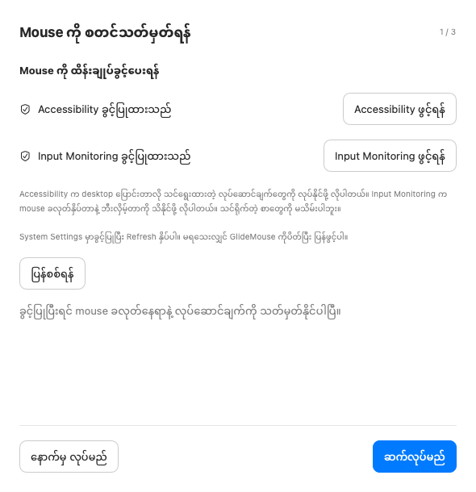
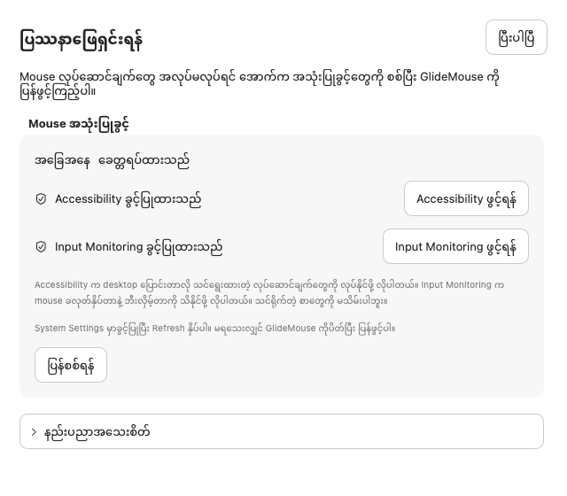
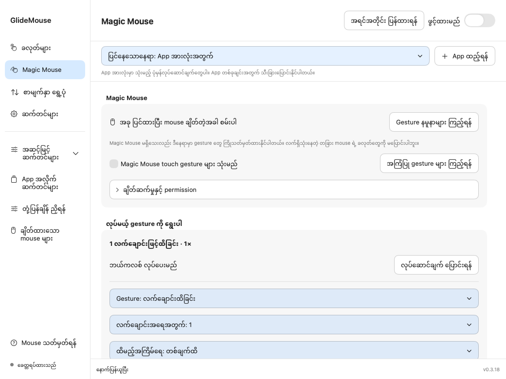

# GlideMouse အသုံးပြုလမ်းညွှန်

Mouse ခလုတ်တွေကို ကိုယ်လိုချင်တဲ့အလုပ် လုပ်ခိုင်းပြီး scroll ကို သုံးရအဆင်ပြေအောင် ချိန်နိုင်တဲ့ macOS app ပါ။ **Minn Khant Thu** က develop လုပ်ထားပြီး English၊ မြန်မာ၊ 简体中文 သုံးဘာသာနဲ့ သုံးနိုင်ပါတယ်။

**[Website](https://minnkhantthuu.github.io/GlideMouse/?lang=my) · [English guide](README.md) · [Video လမ်းညွှန်များ](https://minnkhantthuu.github.io/GlideMouse/tutorials.html#my) · [简体中文](Docs/USER_GUIDE_ZH.md)**

**[GlideMouse ဒေါင်းလုဒ် — macOS DMG, v0.3.19](https://github.com/MinnKhantThuu/GlideMouse/releases/download/v0.3.19/GlideMouse-0.3.19-developer.dmg)**

ဒေါင်းလုဒ်ဆွဲ → Applications ထဲရွှေ့ → App ဖွင့်ပြီး permission ပေး → Mouse လုပ်ဆောင်ချက်ရွေးပြီး သုံးပါ။ Xcode တင်တာ၊ command နဲ့ build လုပ်တာတွေ မလိုပါ။

## ဘာတွေ လုပ်လို့ရလဲ

- ဘီးခလုတ်နဲ့ ဘေးခလုတ်တွေမှာ **တချက်နှိပ်၊ နှစ်ချက်နှိပ်၊ ဖိထား** အတွက် သီးခြားလုပ်ဆောင်ချက် သတ်မှတ်နိုင်ပါတယ်။
- ဘယ်/ညာခလုတ်မှာ **နှစ်ချက်နှိပ်နဲ့ ဖိထား** ကို သတ်မှတ်နိုင်ပြီး ပုံမှန် click နဲ့ drag ကို ဆက်သုံးနိုင်ပါတယ်။
- Desktop ဘယ်/ညာ ပြောင်းတာ၊ Window အားလုံးကြည့်တာ၊ browser နောက်ပြန်/ရှေ့ဆက်၊ media control၊ keyboard shortcut နဲ့ app/folder/website ဖွင့်တာတွေ လုပ်နိုင်ပါတယ်။
- Scroll အမြန်နှုန်း၊ ဦးတည်ချက်၊ ချောမွေ့မှု၊ အရှိန်နဲ့ momentum ကို ချိန်နိုင်ပါတယ်။
- App အားလုံးအတွက် ပုံမှန် setting ထားပြီး လိုအပ်တဲ့ app တွေအတွက်ပဲ သီးခြားပြင်နိုင်ပါတယ်။
- Mouse ခလုတ်နံပါတ်ကို ဖမ်းပြီး အမှန်တကယ်ရှိတဲ့နေရာကို ပုံပေါ်မှာ label ထိုးနိုင်ပါတယ်။
- လုပ်ဆောင်ချက်ဖျက်တာ၊ app setting ဖြုတ်တာ၊ Undo၊ setting Export/Import လုပ်တာတွေ ရပါတယ်။

Mouse control က ဒီ Mac ပေါ်မှာပဲ အလုပ်လုပ်ပါတယ်။ သင်ရိုက်တဲ့စာကို မှတ်တမ်းမသိမ်းပါ။ Update စစ်တဲ့အခါ သတ်မှတ်ထားတဲ့ update server ကို ဆက်သွယ်ပါတယ်။ Website၊ app နဲ့ command ကို ဖွင့်မယ့်လုပ်ဆောင်ချက် ရွေးထားမှ အဲဒီအလုပ်ကို လုပ်ပေးပါတယ်။

## Install လုပ်ပြီး စတင်သုံးရန်

**လိုအပ်ချက်:** macOS 14 နဲ့အထက်၊ Apple Silicon သို့မဟုတ် Intel Mac ဖြစ်ရပါမယ်။ ဘီးခလုတ်/ဘေးခလုတ်ပါတဲ့ USB သို့မဟုတ် Bluetooth mouse နဲ့ သုံးရပိုအဆင်ပြေပါတယ်။ Universal build မှာ CPU နှစ်မျိုးလုံးအတွက် ပါပေမယ့် Mac၊ macOS နဲ့ mouse အမျိုးအစားအားလုံးမှာ physical test ပြီးပြီလို့ မဆိုလိုပါ။

1. **[DMG ကို ဒေါင်းလုဒ်ဆွဲပါ](https://github.com/MinnKhantThuu/GlideMouse/releases/download/v0.3.19/GlideMouse-0.3.19-developer.dmg)**။
2. GlideMouse အဟောင်း ဖွင့်ထားရင် ပိတ်ပါ။ ဒေါင်းလုဒ်ရတဲ့ DMG ကို နှစ်ချက်နှိပ်ပြီး ဖွင့်ပါ။ ပေါ်လာတဲ့ window ထဲမှာ **GlideMouse** ကို **Applications** ပေါ် ဆွဲထည့်ပါ။
3. Applications ထဲက GlideMouse ကိုဖွင့်ပြီး **Mouse သတ်မှတ်ရန်** ကို ဆက်လုပ်ပါ။ App ကူးပြီးရင် GlideMouse disk ကို Eject လုပ်နိုင်ပါတယ်။
4. အောက်က permission နှစ်ခုကို Allow လုပ်ပြီး app ပြန်လာကာ Refresh နှိပ်ပါ။ မရသေးရင် app ပိတ်ပြီး ပြန်ဖွင့်ပါ။
5. ခလုတ်တွေကို သတ်မှတ်၊ လုပ်ဆောင်ချက်ကို သိမ်း၊ GlideMouse ကို ဖွင့်ပြီး ခလုတ်တခုချင်းစီ စမ်းပါ။

Permission မပေးခင် GlideMouse ကို Applications ထဲ အရင်ရွှေ့ထားပါ။ [App ကို ပထမဆုံးဖွင့်ချိန်အတွက် Apple လမ်းညွှန်](https://support.apple.com/102445) ကိုလည်း ဖတ်နိုင်ပါတယ်။

### Permission ကို ဘာလို့ပေးရတာလဲ

| Permission | ဘာအတွက်လဲ | ဘယ်မှာ Allow လုပ်ရမလဲ |
|---|---|---|
| Accessibility | Desktop ပြောင်းတာ၊ shortcut နှိပ်ပေးတာလို သင်ရွေးတဲ့လုပ်ဆောင်ချက်တွေကို လုပ်ပေးရန် | System Settings → Privacy & Security → Accessibility |
| Input Monitoring | Mouse ခလုတ်နဲ့ ဘီးလှည့်တာကို ဖမ်းရန် | System Settings → Privacy & Security → Input Monitoring |

နှစ်ခုလုံးမပေးရင် အပြည့်အဝ အလုပ်မလုပ်နိုင်ပါ။ Permission ပေးတာကြောင့် typed text၊ screenshot နဲ့ device serial ကို သိမ်းစရာမလိုပါ။ Diagnostic export ကို လိုမှလုပ်ပြီး မျှဝေမယ့်ဖိုင်ကို အရင်ကြည့်ပါ။

## Video နဲ့ လေ့လာရန်

သုံးပုံသုံးနည်းကို အဆင့်လိုက်ကြည့်ချင်ရင် အောက်က video တွေကို ကြည့်နိုင်ပါတယ်။ English video မှာ ရှင်းပြသံပါပြီး မြန်မာ video မှာ စာတန်းနဲ့ ရှင်းပြထားပါတယ်။ App ထဲက နမူနာ setting တွေနဲ့ ပြထားတာဖြစ်ပြီး mouse နှိပ်တာနဲ့ Desktop တကယ်ပြောင်းတာကို ရိုက်ထားတဲ့ video မဟုတ်ပါ။

| အပိုင်း | မြန်မာ | English | လေ့လာရမည့်အရာ |
|---|---|---|---|
| ၁။ စတင်သုံးရန် | [ကြည့်ရန်](https://minnkhantthuu.github.io/GlideMouse/tutorials.html#my-setup) | [Watch](https://minnkhantthuu.github.io/GlideMouse/tutorials.html#en-setup) | Permission၊ ခလုတ်နံပါတ်၊ နေရာနဲ့ starter setup |
| ၂။ ခလုတ်လုပ်ဆောင်ချက် | [ကြည့်ရန်](https://minnkhantthuu.github.io/GlideMouse/tutorials.html#my-buttons) | [Watch](https://minnkhantthuu.github.io/GlideMouse/tutorials.html#en-buttons) | Click၊ double click၊ hold နဲ့ Desktop ဘယ်/ညာ |
| ၃။ App အလိုက် setting | [ကြည့်ရန်](https://minnkhantthuu.github.io/GlideMouse/tutorials.html#my-profiles) | [Watch](https://minnkhantthuu.github.io/GlideMouse/tutorials.html#en-profiles) | ပုံမှန် setting၊ သီးခြားပြင်ခြင်း၊ ဖြုတ်ခြင်းနဲ့ Undo |
| ၄။ Scroll နဲ့ ဆက်တင်များ | [ကြည့်ရန်](https://minnkhantthuu.github.io/GlideMouse/tutorials.html#my-scrolling) | [Watch](https://minnkhantthuu.github.io/GlideMouse/tutorials.html#en-scrolling) | Speed၊ direction၊ response၊ language နဲ့ About |
| ၅။ Shortcut နဲ့ အကူအညီ | [ကြည့်ရန်](https://minnkhantthuu.github.io/GlideMouse/tutorials.html#my-shortcuts) | [Watch](https://minnkhantthuu.github.io/GlideMouse/tutorials.html#en-shortcuts) | Shortcut မှတ်တမ်းတင်ခြင်း၊ ဖျက်ခြင်း၊ Undo နဲ့ Help |

## ဘယ် screen ကို ဘာအတွက်သုံးရမလဲ

| Screen | ဘယ်ကဖွင့်ရမလဲ | ဘာလုပ်ဖို့လဲ |
|---|---|---|
| **ခလုတ်များ** | Sidebar | Mouse label ရွေး၊ နှိပ်ပုံရွေး၊ လုပ်ဆောင်ချက်ရွေးပြီး သိမ်းရန် |
| **စာမျက်နှာ ရွေ့ပုံ** | Sidebar | Scroll အမြန်နှုန်း၊ ဦးတည်ချက်၊ ချောမွေ့မှု ပြင်ရန် |
| **ဆက်တင်များ** | Sidebar | ဘာသာစကား၊ အရောင်၊ startup၊ update၊ backup နဲ့ developer contact |
| **Mouse သတ်မှတ်ရန်** | Sidebar အောက်ခြေ၊ ဆက်တင်များ | စတင်သုံးချိန် permission နဲ့ mouse setup |
| **ခလုတ်နေရာ သတ်မှတ်ရန်** | ခလုတ်များ၊ ဆက်တင်များ | ဘီး/ဘေးခလုတ် နံပါတ်ဖမ်းပြီး နေရာရွေးရန် |
| **App အလိုက် ဆက်တင်များ** | အဆင့်မြင့်ကို ချဲ့ပါ | ရွေးထားတဲ့ app မှာ သက်ရောက်မယ့်လုပ်ဆောင်ချက်ကြည့်ရန် |
| **တုံ့ပြန်ချိန် ညှိရန်** | အဆင့်မြင့်ကို ချဲ့ပါ | နှိပ်ချိန် preset နဲ့ အသေးစိတ် timing ပြင်ရန် |
| **ချိတ်ထားသော mouse များ** | အဆင့်မြင့်ကို ချဲ့ပါ | ချိတ်ထားတဲ့ mouse နဲ့ compatibility ကြည့်ရန် |
| **ပြဿနာဖြေရှင်းရန်** | macOS Help menu | Permission နဲ့ လိုအပ်မှ diagnostic စစ်ရန် |

## ခလုတ်လုပ်ပုံကို ကြည့်ရန်

**ခလုတ်များ** စာမျက်နှာက **ခလုတ်လုပ်ပုံ ကြည့်ရန်** ကိုနှိပ်ပါ။ နမူနာရွေးပြီး နှိပ်ပုံနဲ့ ရလာဒ်ကို animation နဲ့ တွဲကြည့်နိုင်ပါတယ်။ ရပ်ထား၊ ပြန်ကြည့် ခလုတ်တွေလည်း ပါပါတယ်။ Internet မရှိလည်း app ထဲမှာ ကြည့်နိုင်ပြီး [website](https://minnkhantthuu.github.io/GlideMouse/?lang=my#mouse-guide) မှာလည်း ပါပါတယ်။ ကြည့်နေရုံနဲ့ mouse settings မပြောင်းသွားသလို Mac ပေါ်မှာလည်း action မလုပ်ပါဘူး။ Magic Mouse touch နမူနာတွေက စမ်းသပ်ဆဲပါ။ Mouse အစစ်နဲ့ စစ်ဖို့ ကျန်ပါသေးတယ်။

## ၁။ ခလုတ်နံပါတ်နဲ့ နေရာကို အရင်သတ်မှတ်ပါ

1. သတ်မှတ်မယ့် mouse တလုံးတည်းကို ချိတ်ထားပါ။
2. **ခလုတ်နေရာ သတ်မှတ်ရန်** ကိုဖွင့်ပြီး input capture စပါ။
3. Pointer ကို အကွက်ထဲရွှေ့ပြီး ဘီးခလုတ် ဒါမှမဟုတ် ဘေးခလုတ်တခုကို နှိပ်ပါ။
4. ဖမ်းမိတဲ့နံပါတ်ကို ကြည့်ပါ။ ဘီးခလုတ်၊ အပေါ်ဘေးခလုတ်၊ အောက်ဘေးခလုတ်၊ အခြားခလုတ် ဆိုပြီး နေရာရွေးကာ အတည်ပြုပါ။
5. ကျန်ခလုတ်တွေအတွက်လည်း ထပ်လုပ်ပြီး ပြီးပါပြီ ကိုနှိပ်ပါ။

Mouse က ခလုတ်နံပါတ်ကိုပဲ ပြောနိုင်ပြီး ဘယ်နေရာမှာရှိလဲဆိုတာ မပြောနိုင်ပါ။ ဒါကြောင့် နေရာကို သင်ရွေးပေးရတာပါ။ **ခလုတ် 4 က mouse တိုင်းမှာ အောက်ဘေးခလုတ်လို့ မသတ်မှတ်နိုင်ပါ။** Mouse အလိုက် နံပါတ်ကွာနိုင်ပါတယ်။ 1 နဲ့ 2 က ပုံမှန်အားဖြင့် ဘယ်/ညာခလုတ်ပါ။ Mouse ပုံက လမ်းညွှန်ပုံသာဖြစ်ပြီး သင့် model ရဲ့ အတိအကျဓာတ်ပုံ မဟုတ်ပါ။

ခလုတ်များ screen က အပြာရောင်အကွက်ထဲ နှိပ်ရင်လည်း ခလုတ်ကို auto ရွေးပေးပါတယ်။ အကွက်အပြင်မှာ ရှိပြီးသားလုပ်ဆောင်ချက်တွေ ဆက်သုံးနိုင်ပါတယ်။ Mouse identity ကို ဆက်သိနိုင်ရင် ပြန်ဖွင့်ချိန်မှာ label တွေကို ထိန်းထားပါတယ်။

## ၂။ တချက်နှိပ်၊ နှစ်ချက်နှိပ်၊ ဖိထားကို သတ်မှတ်ပါ

1. **ခလုတ်များ** မှာ ပုံပေါ်က label ကိုရွေးပါ။ အပြာရောင်အကွက်ထဲ ခလုတ်နှိပ်ပြီးလည်း ရွေးနိုင်ပါတယ်။
2. **ခလုတ်နှိပ်ပုံ** နေရာမှာ တချက်နှိပ်၊ နှစ်ချက်နှိပ် သို့မဟုတ် ဖိထားကို ရွေးပါ။
3. **လုပ်ဆောင်ချက်** နေရာက dropdown ကိုဖွင့်ပြီး လုပ်ပေးစေချင်တာကို ရွေးပါ။ Search နဲ့ ရှာနိုင်ပါတယ်။
4. **App အားလုံးအတွက် သိမ်းရန်** ကိုနှိပ်ပါ။ App တခုရွေးထားရင် **ဒီ app အတွက် သိမ်းရန်** ကိုနှိပ်ပါ။
5. Capture အကွက်အပြင်ကို ရွှေ့ပြီး အဲဒီခလုတ်ကို စမ်းပါ။

**နှိပ်ပုံနဲ့ လုပ်ဆောင်ချက်က မတူပါ။** အပေါ်က “နှစ်ချက်နှိပ်” ဆိုတာ သင်က mouse ခလုတ်ကို နှစ်ချက်နှိပ်ရမယ့်ပုံစံပါ။ Action စာရင်းထဲက “ဘယ်ကလစ်နှစ်ချက်လုပ်မည်” ဆိုတာ app က နှစ်ချက်နှိပ်ပေးမယ့်အရာပါ။ ဥပမာ ဘေးခလုတ်တချက်နှိပ်ရင် app က ဘယ်ကလစ်နှစ်ချက် လုပ်ပေးလို့ရပါတယ်။

### နမူနာ — ဘေးခလုတ်နဲ့ Desktop ပြောင်းရန်

| သတ်မှတ်ပြီးသား နမူနာ mouse မှာ နှိပ်ပုံ | လုပ်ဆောင်ချက် |
|---|---|
| အောက်ဘေးခလုတ် → တချက်နှိပ် | Desktop ဘယ်ဘက်သို့ |
| အပေါ်ဘေးခလုတ် → တချက်နှိပ် | Desktop ညာဘက်သို့ |
| အောက်ဘေးခလုတ် → ဖိထား | Window အားလုံး ကြည့်ရန် / Mission Control |

သင့် mouse ကို ဖမ်းမိတဲ့နံပါတ်နဲ့ သုံးပါ။ Desktop/Space တခုထက်ပိုရှိရပြီး macOS Keyboard → Keyboard Shortcuts → Mission Control မှာ Control + ဘယ်/ညာမြှား shortcut ကို ဖွင့်ထားရပါမယ်။ မပြောင်းရင် keyboard ကနေ အဲဒီ shortcut ကို အရင်စမ်းပါ။ GlideMouse က shortcut ပို့ပေးတာဖြစ်ပြီး Desktop ပြောင်းတဲ့ animation ကို macOS က လုပ်ပါတယ်။

### ဘယ်/ညာခလုတ် 1 နဲ့ 2

1 သို့မဟုတ် 2 ကိုရွေးပြီး နှစ်ချက်နှိပ်၊ ဖိထားကို သတ်မှတ်နိုင်ပါတယ်။ ပုံမှန် click နဲ့ drag က ဆက်သုံးနိုင်ပါတယ်။ မသတ်မှတ်ထားရင် click ကို ချက်ချင်း system သို့ပို့ပါတယ်။ Double click setting ရှိရင် တချက်နှိပ်နဲ့ နှစ်ချက်နှိပ်ကို ခွဲဖို့ ခဏစောင့်ရပါတယ်။ Hold setting ရှိရင် short click က ခလုတ်လွှတ်ချိန်မှ ဖြစ်ပါတယ်။ အမြန်တုံ့ပြန်ဖို့အဓိကကျတဲ့ခလုတ်မှာ double click ကို လိုမှထည့်ပါ။

### ပြန်ဖျက်ရန်

ခလုတ်နဲ့ **နှိပ်ပုံကိုပါ** ရွေးပြီး **လုပ်ဆောင်ချက် ဖျက်ရန်** ကိုနှိပ်ပါ။ တချက်နှိပ်ကို ဖျက်ရင် ဖိထားနဲ့ နှစ်ချက်နှိပ်ကို မဖျက်ပါ။ မှားဖျက်မိရင် Undo ပြန်လုပ်ပါ။ App တခုအတွက် သီးခြားပြင်ထားတာကို ဖြုတ်ချင်ရင် **App အားလုံးအတွက် လုပ်ဆောင်ချက်အတိုင်း ပြန်ထားရန်** ကို သုံးပါ။

## ၃။ App တခုမှာပဲ မတူတဲ့အလုပ်လုပ်စေချင်ရင်

**App အားလုံးအတွက်** က ပုံမှန် setting ပါ။ ပုံမှန်သုံးဖို့ app profile ထည့်စရာမလိုပါ။

1. အပေါ် scope bar မှာ **App ထည့်ရန်** ကိုနှိပ်ပြီး install လုပ်ထားတဲ့ `.app` ကိုရွေးပါ။
2. ပြင်နေသော app နာမည်ကို စစ်ပါ။
3. ခလုတ်တခုကိုရွေး၊ လုပ်ဆောင်ချက်ပြောင်းပြီး **ဒီ app အတွက် သိမ်းရန်** ကိုနှိပ်ပါ။
4. အဲဒီ app ကိုဖွင့်ပြီး စမ်းပါ။ အဲဒီ app က foreground ဖြစ်ချိန်မှာပဲ သက်ရောက်ပါတယ်။

ဥပမာ — အောက်ဘေးခလုတ်တချက်နှိပ်ကို ပုံမှန်အားဖြင့် Desktop ဘယ်ဘက်သို့ သတ်မှတ်ထားပြီး Safari မှာတော့ နောက်ပြန် သတ်မှတ်ထားနိုင်ပါတယ်။ Safari မှာ အဲဒီ input တခုတည်း ပြောင်းပြီး အခြားခလုတ်တွေက ပုံမှန် setting ဆက်ယူပါတယ်။ “ပုံမှန် setting မှ ယူထားသည်” က inherited action ဖြစ်ပြီး “ဒီ app အတွက် သီးခြား” က override ဖြစ်ပါတယ်။

App ကိုရွေးပြီး **App ဖြုတ်ရန်** နှိပ်ရင် GlideMouse ထဲက setting ပဲ ဖြုတ်ပါတယ်။ **အဲဒီ app ကို uninstall မလုပ်ပါ။** ပုံမှန် setting ပြန်သက်ရောက်ပါတယ်။ Undo နဲ့ ပြန်ယူပြီး အပေါ် dropdown မှာ app ကို ပြန်ရွေးကာ ဆက်ပြင်နိုင်ပါတယ်။

## ၄။ Scroll ကို သုံးရအဆင်ပြေအောင် ချိန်ပါ

ပုံမှန် ဒါမှမဟုတ် ချောမွေ့ ကို အရင်ရွေးပါ။ Speed နဲ့ direction ကို ချိန်ပြီး လိုအပ်မှ အသေးစိတ်ကို ချဲ့ပါ။

| Control | အဓိပ္ပာယ် | ဘယ်လိုချိန်ရမလဲ |
|---|---|---|
| အမြန်နှုန်း | ဘီးတချက်လှည့်ရင် ရွေ့မယ့်အကွာအဝေး | တအားကျော်သွားရင် လျှော့ပါ |
| ဦးတည်ချက် | ပုံမှန် သို့မဟုတ် ပြောင်းပြန် scroll | ကိုယ်ကျွမ်းကျင်တဲ့ direction ကိုရွေးပါ |
| ချောမွေ့မှု | ဘီးလှည့်တိုင်း ရွေ့တာကို ဖြည်းဖြည်းဖြန့်ပေးခြင်း | နူးညံ့ချင်ရင် တိုး၊ ချက်ချင်းတုံ့ပြန်ချင်ရင် လျှော့ပါ |
| Momentum | ဘီးရပ်ပြီးနောက် ခဏဆက်ရွေ့ခြင်း | အတိအကျရပ်ဖို့ခက်ရင် ပိတ်ပါ |
| အရှိန်တိုး | ဘီးကို မြန်မြန်လှည့်ရင် ပိုရွေ့ခြင်း | တသမတ်တည်းလိုရင် လျှော့ပါ၊ zero ဆို အရှိန်မတိုးပါ |
| Shift + wheel | ဘေးတိုက် scroll | စာရွက်ကျယ်၊ timeline တွေမှာ သုံးနိုင်ပါတယ် |
| Control + wheel | အသေးစိတ် scroll | အနည်းငယ်ပဲ ရွေ့ချင်ချိန် သုံးနိုင်ပါတယ် |
| Option + wheel | Shortcut နဲ့ zoom | လက်ရှိ app ရဲ့ zoom shortcut ပေါ်မူတည်ပါတယ် |

App တခုရွေးထားရင် **ဒီ app အတွက် scroll သီးခြားသုံးရန်** ကို ဖွင့်မှ ပြင်ပါ။ ပိတ်ထားရင် ပုံမှန် scroll setting ကို ဆက်သုံးပါတယ်။ Trackpad နဲ့ Magic Mouse ရဲ့ continuous scroll ကို system အတိုင်း ထားပြီး ဒီ controls တွေက ပုံမှန် mouse wheel အတွက်ပါ။

## ၅။ Keyboard shortcut မှတ်တမ်းတင်ရန်

Action မှာ **Keyboard shortcut** ကိုရွေးပြီး **Shortcut မှတ်တမ်းတင်ရန်** ကိုနှိပ်ပါ။ မှတ်တမ်းတင်တဲ့အကွက်မှာ focus ရှိနေချိန် ခလုတ်တွဲကို တခါနှိပ်ပါ။ Command + C ဆို **⌘C** လို့ပြပါတယ်။ ပြီးရင် ရည်ရွယ်ထားတဲ့ app scope အတွက် သိမ်းပါ။ အဲဒီ focused field ထဲမှာပဲ record လုပ်ပါတယ်။

Shortcut က လက်ရှိ app မှာ သက်ရောက်တာဖြစ်လို့ mouse မှာ မထည့်ခင် keyboard ကနေ အရင်စမ်းပါ။ App/folder/website ဖွင့်တဲ့ action တွေမှာ target ကိုရွေးပေးရပါတယ်။ Shell command နဲ့ Apple Shortcuts က advanced action တွေဖြစ်ပြီး ခွင့်ပြုထားမှ run ပါတယ်။ Import လုပ်လာတဲ့ automation ကို စစ်မပြီးခင် ပိတ်ထားပါတယ်။

**အသေးစိတ် သတ်မှတ်ချက်ထည့်ရန်** မှာ ဖိထားပြီး ရွှေ့ခြင်း၊ ဖိထားပြီး scroll၊ modifier ခလုတ်တွဲနဲ့ အခြား gesture တွေကို ထည့်နိုင်ပါတယ်။ ပုံမှန်အသုံးပြုသူအတွက် mouse ပုံနဲ့ Click/Double click/Hold ပဲ သုံးရင် လုံလောက်ပါတယ်။

## ၆။ ဆက်တင်၊ Backup နဲ့ အကူအညီ

- **ဘာသာစကား:** English၊ မြန်မာ၊ 简体中文။ ပြောင်းရင် mouse action မပြောင်းပါ။
- **အရောင်ပုံစံ:** System အတိုင်း၊ အလင်း၊ အမှောင်။
- **Mac စဖွင့်ချိန် run:** Login လုပ်တာနဲ့ app စရန်။
- **Screen ပေါ် action နာမည်ပြရန်:** လိုမှဖွင့်ပါ။ စာတန်းမပေါ်စေချင်ရင် ပိတ်နိုင်ပါတယ်။
- **Updates:** ကိုယ်တိုင်စစ်နိုင်သလို အလိုအလျောက်စစ်/ဒေါင်းလုဒ်လုပ်နိုင်ပါတယ်။ Feed ထဲမှာ signed version အသစ်ရှိမှ install ဖြစ်ပါမယ်။ Signed update feed မှာ 0.3.19 ရှိပါပြီ။ သီးခြား app မိတ္တူနဲ့ 0.3.18 ကနေ 0.3.19 ကို အလိုအလျောက် ဒေါင်းလုဒ်လုပ်၊ install လုပ်ပြီး app ပြန်ဖွင့်နိုင်တာ စမ်းထားပါတယ်။ Apple ရဲ့ Gatekeeper စစ်ဆေးမှုလည်း အောင်မြင်ပါတယ်။
- **သင့် setting:** Export က JSON backup ထုတ်ပေးပါတယ်။ Import မှာ အရင် review ပြပြီး Merge/Replace ရွေးရပါတယ်။ Replace က engine ကို pause လုပ်ပြီး imported command automation ကို ပိတ်ထားပါတယ်။ Merge က rule ထပ်နေမှုကို လက်မခံပါ။
- **About:** Developer၊ version၊ email၊ website နဲ့ Buy Me a Coffee။

**Help → ပြဿနာဖြေရှင်းရန်** ကို sidebar မှာ ဝှက်ထားပါတယ်။ အရင်ဆုံး permission တွေကို ပြပြီး နည်းပညာအသေးစိတ်ကို လိုမှ ချဲ့ပါ။ Action စမ်းတဲ့နေရာက အတည်ပြုရင် Mac ပေါ်မှာ တကယ်လုပ်ပေးတာပါ။ Diagnostic export မှာ mouse နာမည်နဲ့ input အမျိုးအစားတွေ ပါနိုင်လို့ issue တင်ခင် ဖိုင်ကို စစ်ပါ။

**အရေးပေါ်ရပ်ရန်:** Control + Option + Command + Escape (**⌃⌥⌘ Esc**)။ Menu bar ကနေ ခေတ္တရပ်ထား လို့လည်းရပြီး အဆင်သင့်ဖြစ်ရင် ပြန်ဖွင့်နိုင်ပါတယ်။

## မရရင် ဘာစစ်ရမလဲ

| ပြဿနာ | စစ်ရမည့်အရာ |
|---|---|
| ဘာမှမလုပ်ပါ | Engine ဖွင့်ထားလား၊ permission နှစ်ခုရလား၊ mouse ချိတ်ထားလား၊ permission ပေးပြီး app ပြန်ဖွင့်ထားလား |
| ခလုတ်မှားနေပါ | နံပါတ် 4/5 ကို မခန့်မှန်းဘဲ capture ပြန်လုပ်ပြီး နေရာအတည်ပြုပါ |
| Desktop မပြောင်းပါ | Desktop တခုထက်ပိုရှိလား၊ macOS shortcut ဖွင့်ထားလား၊ keyboard Control + မြှားနဲ့ ရလား |
| App တခုမှာပဲရပါ | Scope bar၊ app override၊ app pause နဲ့ foreground app ကို စစ်ပါ |
| Click နှေးနေပါ | Double-click/hold setting နဲ့ timing ကို စစ်ပါ။ Desktop animation နဲ့ ခွဲကြည့်ပါ |
| Mouse tool နှစ်ခု တိုက်နေပါ | စမ်းချိန်မှာ အခြား tool ကို pause လုပ်ပြီး နှိုင်းယှဉ်ပါ။ GlideMouse က အဲဒီ tool ကို မပြောင်းပေးပါ |
| Update မတွေ့ပါ | Feed မှာ version အသစ်ရှိလား စစ်ပါ။ GitHub source ပြောင်းရုံနဲ့ install လုပ်ထားတဲ့ app က update မဖြစ်ပါ |

ပြန်ဖြစ်အောင်စမ်းလို့ရတဲ့ bug တွေကို [Issues](https://github.com/MinnKhantThuu/GlideMouse/issues) မှာတင်နိုင်ပါတယ်။ Version၊ macOS၊ mouse model၊ app scope၊ permission နဲ့ နှိပ်တဲ့အဆင့်တွေကို ရေးပါ။ Secret နဲ့ မဆိုင်တဲ့ app screenshot တွေ မတင်ပါနဲ့။

## လက်ရှိ ကန့်သတ်ချက်များ

Magic Mouse touch gesture က experimental ဖြစ်ပြီး Magic Mouse hardware အစစ်နဲ့ မစမ်းရသေးပါ။ Mouse တလုံးချင်းစီအတွက် button/wheel setting သီးခြားလုပ်တာကို reliable device attribution မရသေးလို့ မဖွင့်ထားပါ။ Native continuous desktop swipe၊ magnify နဲ့ Smart Zoom မရသေးပါ။ Shortcut သုံးတဲ့ action တွေက macOS နဲ့ app setting ပေါ်မူတည်ပါတယ်။ Vendor-specific ခလုတ်တွေက ပုံမှန် input မပို့ရင် မဖမ်းနိုင်ပါ။ [Compatibility](Docs/COMPATIBILITY.md) ကို ကြည့်နိုင်ပါတယ်။

## Developer ကို ဆက်သွယ်ရန်

**Minn Khant Thu** · [Website](https://minnkhantthu.up.railway.app/) · [Email](mailto:minnkhantthu.ucsy@gmail.com) · [Buy Me a Coffee](https://buymeacoffee.com/minnkhantthu)

[MIT license](LICENSE) နဲ့ ဖြန့်ထားပြီး [Third-party notices](THIRD_PARTY_NOTICES.md) လည်း ပါပါတယ်။ Source ပြင်ပြီး ပါဝင်ကူညီချင်သူတွေအတွက် [Contributing](CONTRIBUTING.md) မှာ သီးခြားရေးထားပါတယ်။

## Magic Mouse ကြိုသတ်မှတ်ရန်

Mouse မရှိသေးလည်း Magic Mouse စာမျက်နှာမှာ တစ်ချက်/နှစ်ချက်/သုံးချက်ထိ၊ လက်ချောင်းတစ်ချောင်း/နှစ်ချောင်း/သုံးချောင်း၊ ညာခြမ်းထိ၊ swipe၊ pinch၊ drag၊ drag လုပ်ရင်း scroll နဲ့ key တွဲနှိပ်တာတွေကို သတ်မှတ်ထားနိုင်ပါတယ်။ ပြင်၊ ဖျက်၊ Undo နဲ့ app အလိုက်ဆက်တင်တွေ ပါပါတယ်။ Mouse အစစ်နဲ့ စမ်းဖို့ ကျန်ပါတယ်။ [သတ်မှတ်ပုံနှင့် စမ်းရမည့်အချက်များ](Docs/guides/MAGIC_MOUSE.md)။

