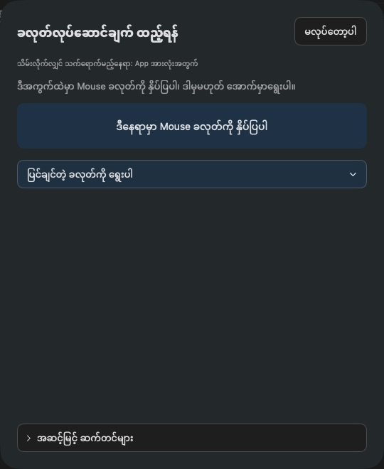
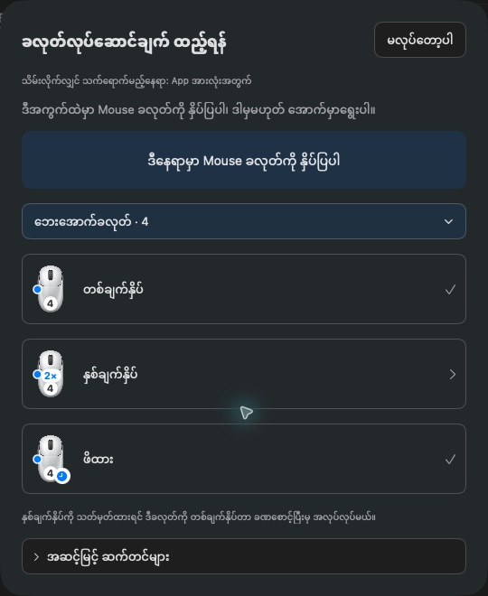
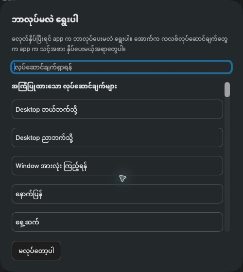
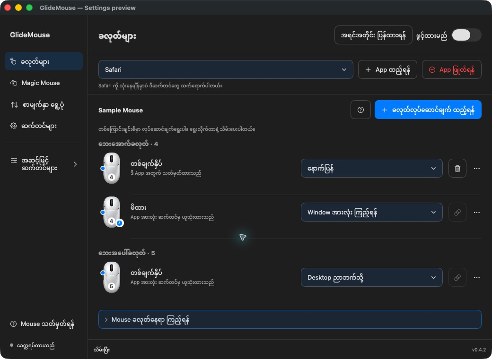
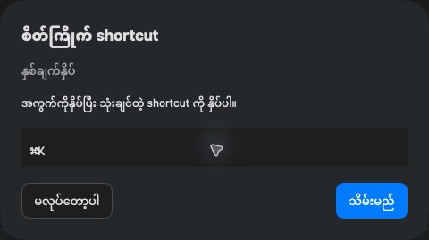

# GlideMouse အသုံးပြုနည်း

Mouse ခလုတ်နှိပ်ရင် ဘာလုပ်ပေးမလဲ ရွေးထားနိုင်ပါတယ်။ ဘေးခလုတ်နဲ့ Desktop ပြောင်းတာ၊ ဖွင့်ထားတဲ့ window တွေကြည့်တာ၊ ဘီးလှည့်တဲ့အမြန်နှုန်း ချိန်တာတွေကို GlideMouse မှာ သတ်မှတ်နိုင်ပါတယ်။ App တစ်ခုမှာပဲ မတူတဲ့လုပ်ဆောင်ချက် သုံးချင်ရင်လည်း ပြောင်းထားနိုင်ပါတယ်။

**[Website](https://minnkhantthuu.github.io/GlideMouse/?lang=my) · [ပုံနဲ့ အဆင့်လိုက်ကြည့်ရန်](https://minnkhantthuu.github.io/GlideMouse/tutorials.html#my-buttons) · [English](README.md) · [简体中文](Docs/USER_GUIDE_ZH.md)**

**[Mac အတွက် ဒေါင်းလုဒ် — DMG](https://github.com/MinnKhantThuu/GlideMouse/releases/download/v0.4.2/GlideMouse-0.4.2.dmg)**

ဒီလမ်းညွှန်နဲ့ ပုံတွေက **0.4.2** အတွက်ပါ။ အခြားဗားရှင်းတွေကို [Releases](https://github.com/MinnKhantThuu/GlideMouse/releases) မှာ ကြည့်နိုင်ပါတယ်။

## ထည့်သွင်းပြီး စသုံးရန်

**macOS 14 နဲ့အထက်** သုံးထားတဲ့ Apple Silicon ဒါမှမဟုတ် Intel Mac လိုပါတယ်။ DMG ဖိုင်ကိုဖွင့်ပြီး GlideMouse ကို **Applications** ထဲ ဆွဲထည့်ပါ။ အဟောင်းဖွင့်ထားရင် ပိတ်ပြီးမှ အသစ်ကိုဖွင့်ပါ။

**Mouse သတ်မှတ်ရန်** ကိုဖွင့်ပြီး macOS ဆက်တင်မှာ ခွင့်ပြုချက်နှစ်ခု ပေးပါ။ ပြီးရင် GlideMouse ဆီပြန်လာပြီး **ပြန်စစ်ရန်** ကိုနှိပ်ပါ။ မသက်ရောက်သေးရင် app ကို ပိတ်ပြီးပြန်ဖွင့်ပါ။

| ခွင့်ပြုချက် | ဘာအတွက်လဲ |
|---|---|
| Accessibility | ကိုယ်ရွေးထားတဲ့ shortcut၊ Desktop ပြောင်းတာ စတဲ့အလုပ်တွေ လုပ်ပေးဖို့ |
| Input Monitoring | Mouse ခလုတ်နှိပ်တာနဲ့ ဘီးလှည့်တာကို သိဖို့ |

ဆက်တင်တွေကို ဒီ Mac ထဲမှာပဲ သိမ်းပါတယ်။ Keyboard နဲ့ရိုက်တဲ့စာကို မှတ်တမ်းမသိမ်းပါဘူး။ Update စစ်တဲ့အခါ update server ကို ချိတ်ပါတယ်။ Website ဖွင့်တာ ဒါမှမဟုတ် အလိုအလျောက်လုပ်ဆောင်ချက်တစ်ခု သတ်မှတ်ထားရင် သက်ဆိုင်ရာနေရာကို ချိတ်နိုင်ပါတယ်။

## ဘယ်စာမျက်နှာမှာ ဘာလုပ်လို့ရလဲ

| စာမျက်နှာ | သုံးရမယ့်အချိန် |
|---|---|
| **ခလုတ်များ** | ခလုတ်တစ်ခု ထည့်ချင်၊ လုပ်ဆောင်ချက် ပြောင်းချင်၊ ဖျက်ချင်တဲ့အခါ |
| **စာမျက်နှာ ရွေ့ပုံ** | ဘီးလှည့်ပုံ၊ အမြန်နှုန်းနဲ့ ဦးတည်ချက် ချိန်ချင်တဲ့အခါ |
| **ဆက်တင်များ** | ဘာသာစကား၊ အလင်း/အမှောင်၊ update နဲ့ ဆက်တင်အရန်သိမ်းတာတွေ ပြင်ချင်တဲ့အခါ |
| **Mouse သတ်မှတ်ရန်** | ခွင့်ပြုချက်စစ်ချင်၊ ဘယ်နံပါတ်က ဘယ်ခလုတ်လဲ သိချင်တဲ့အခါ |
| **Magic Mouse** | Magic Mouse ရဲ့ မျက်နှာပြင်ပေါ်က နှိပ်တာ၊ ပွတ်တာတွေ သတ်မှတ်ချင်တဲ့အခါ။ Direct-download ဗားရှင်းမှာပဲ ပါပြီး mouse အစစ်နဲ့ စမ်းဖို့ကျန်ပါတယ် |
| **အဆင့်မြင့် → App အလိုက် ဆက်တင်များ** | App တစ်ခုအတွက် ပြောင်းထားတာနဲ့ ပုံမှန်ဆက်တင်က ယူသုံးထားတာတွေ ပြန်ကြည့်ချင်တဲ့အခါ |
| **အဆင့်မြင့် → တုံ့ပြန်နှုန်း / ချိတ်ထားသော mouse များ** | အသေးစိတ်ချိန်ချင်၊ ချိတ်ထားတဲ့ mouse အချက်အလက် ကြည့်ချင်တဲ့အခါ |
| **Help → ပြဿနာစစ်ဆေးရန်** | အလုပ်မလုပ်တဲ့အကြောင်းရင်း စစ်ချင်တဲ့အခါ |

အဆင့်မြင့်ဆက်တင်တွေကို ပုံမှန်သုံးဖို့ ဖွင့်စရာမလိုပါဘူး။ လိုတဲ့အခါ ခေါင်းစဉ်တစ်ကြောင်းလုံးကို နှိပ်ပြီး ဖွင့်ပိတ်နိုင်ပါတယ်။

## ၁။ ခလုတ်နှိပ်ရင် ဘာလုပ်မလဲ ရွေးပါ

1. **ခလုတ်များ** ကိုဖွင့်ပြီး အပေါ်မှာ **App အားလုံးအတွက်** ကိုထားပါ။
2. **ခလုတ်လုပ်ဆောင်ချက် ထည့်ရန်** ကိုနှိပ်ပါ။
3. အကွက်ထဲမှာ ကိုယ်သုံးမယ့် mouse ခလုတ်ကို နှိပ်ပြပါ။ App က ခလုတ်နံပါတ်ကို ရွေးပေးပါမယ်။ သိပြီးသားခလုတ်ဆို စာရင်းကနေလည်း ရွေးနိုင်ပါတယ်။

4. **တစ်ချက်နှိပ်၊ နှစ်ချက်နှိပ်၊ ဖိထား** ထဲက ကိုယ်သုံးချင်တဲ့ နှိပ်ပုံကိုရွေးပါ။

5. ဘာလုပ်ပေးမလဲ ရွေးပါ။ ပုံမှန်လုပ်ဆောင်ချက်တွေက ရွေးတာနဲ့ သိမ်းပြီးသားပါ။ Shortcut နဲ့ website လင့်ခ်လိုတာတွေက အသေးစိတ်ဖြည့်ပြီး **သိမ်းမည်** ကိုနှိပ်ရပါတယ်။
6. GlideMouse ကိုဖွင့်ထားပြီး ခလုတ်ဖမ်းတဲ့အကွက်အပြင်မှာ စမ်းနှိပ်ကြည့်ပါ။

**ခလုတ်နံပါတ်ကိုကြည့်ရုံနဲ့ ဘယ်နေရာကခလုတ်လဲ မသိနိုင်ပါဘူး။** Mouse တစ်မျိုးနဲ့တစ်မျိုး နံပါတ်ကွာနိုင်ပါတယ်။ **Mouse ခလုတ်နေရာ ကြည့်ရန်** ကိုဖွင့်ပြီး ခလုတ်နှိပ်ပြကာ ဘယ်နေရာကခလုတ်လဲ သတ်မှတ်နိုင်ပါတယ်။ စာရင်းတစ်ကြောင်းစီက mouse ပုံငယ်နဲ့ နံပါတ်ကိုကြည့်ပြီး ဘယ်ခလုတ်ကို ပြင်နေတာလဲ သိနိုင်ပါတယ်။

| ကိုယ်နှိပ်မယ့်ပုံစံ | လုပ်ပေးစေချင်တဲ့အလုပ် |
|---|---|
| အောက်ဘေးခလုတ် တစ်ချက်နှိပ် | ဘယ်ဘက် Desktop ကိုပြောင်း |
| အပေါ်ဘေးခလုတ် တစ်ချက်နှိပ် | ညာဘက် Desktop ကိုပြောင်း |
| အောက်ဘေးခလုတ် ဖိထား | Window အားလုံးကြည့် — Mission Control |

Desktop ပြောင်းဖို့ macOS မှာ Desktop/Space တစ်ခုထက်ပို ရှိရပါမယ်။ **Keyboard → Keyboard Shortcuts → Mission Control** မှာ Control–Left/Right ဖွင့်ထားဖို့လည်း လိုပါတယ်။ မပြောင်းရင် keyboard ကနေ အရင်စမ်းပါ။

**နှိပ်ပုံနဲ့ လုပ်ဆောင်ချက်ကို ခွဲကြည့်ပါ။** ဘယ်ဘက်က “နှစ်ချက်နှိပ်” က ကိုယ်က mouse ခလုတ်ကို နှစ်ချက်နှိပ်မယ်လို့ ဆိုတာပါ။ ညာဘက်မှာ “ဘယ်ကလစ် နှစ်ချက်လုပ်ပေးမည်” ရွေးထားရင် app က ဘယ်ကလစ်နှစ်ချက် လုပ်ပေးမှာပါ။ ဘေးခလုတ်တစ်ချက်နှိပ်ပြီး ဘယ်ကလစ်နှစ်ချက် လုပ်ခိုင်းလို့လည်း ရပါတယ်။

ဘယ်ခလုတ် **1** နဲ့ ညာခလုတ် **2** မှာလည်း နှစ်ချက်နှိပ်နဲ့ ဖိထားကို သတ်မှတ်နိုင်ပါတယ်။ ပုံမှန်ကလစ်နဲ့ ဖိဆွဲတာတွေ ဆက်သုံးနိုင်ပါတယ်။ နှစ်ချက်နှိပ် သတ်မှတ်ထားရင် တစ်ချက်လား နှစ်ချက်လား ခွဲဖို့ ခဏစောင့်ရတာကြောင့် တစ်ချက်နှိပ်တဲ့အလုပ် နည်းနည်းနှေးနိုင်ပါတယ်။

## ၂။ ပြောင်းချင်၊ ဖျက်ချင်ရင်

ပြောင်းချင်တဲ့တစ်ကြောင်းရဲ့ ညာဘက်အကွက်ကိုနှိပ်ပါ။ စာသားနဲ့ ဘေးလွတ်နေရာပါ နှိပ်လို့ရပါတယ်။ နာမည်နဲ့ရှာပြီး လုပ်ဆောင်ချက်အသစ်ရွေးတာနဲ့ သိမ်းပေးပါတယ်။

ဖျက်ချင်ရင် အဲဒီတစ်ကြောင်းရဲ့ **အမှိုက်ပုံးခလုတ်** ကိုနှိပ်ပါ။ တစ်ချက်နှိပ်ကိုဖျက်တာက နှစ်ချက်နှိပ်နဲ့ ဖိထားကို မဖျက်ပါဘူး။ မှားဖျက်မိရင် အပေါ်က **အရင်အတိုင်း ပြန်ထားရန်** နဲ့ ပြန်ယူနိုင်ပါတယ်။ **…** မှာ အသေးစိတ်ပြင်တာ၊ အဆင့်မြင့်သတ်မှတ်တာနဲ့ app တစ်ခုအတွက် ပြောင်းထားတဲ့အလုပ်ကို ပုံမှန်အတိုင်း ပြန်ထားတာတွေ ပါပါတယ်။

အသံတိုးချင်ရင် **အသံကျယ်စေရန်**၊ လျှော့ချင်ရင် **အသံလျှော့ရန်** ရွေးပါ။ **အသံပိတ် / ပြန်ဖွင့်ရန်** က mute ကို ဖွင့်ပိတ်ပေးပါတယ်။ **App ရှာဖွင့်ရန် (Spotlight)** က app ရှာတဲ့အကွက်ကိုဖွင့်ပြီး **Screenshot ရိုက်ရန် ကိရိယာများဖွင့်မည်** က macOS screenshot toolbar ကိုဖွင့်ပေးပါတယ်။

## ၃။ App တစ်ခုမှာပဲ သီးခြားသုံးပါ

**App အားလုံးအတွက်** ဆိုတာ ပုံမှန်သုံးမယ့်ဆက်တင်ပါ။ App တစ်ခုမှာ မတူတဲ့အလုပ် လုပ်ပေးစေချင်မှ အဲဒီ app ကို ထည့်ပါ။

1. အပေါ်က **App ထည့်ရန်** ကိုနှိပ်ပြီး app တစ်ခုရွေးပါ။
2. အပေါ်မှာ အဲဒီ app နာမည်ပေါ်နေကြောင်း စစ်ပါ။
3. ပြောင်းချင်တဲ့ခလုတ်ရဲ့ လုပ်ဆောင်ချက်ကိုရွေးပါ။ အဲဒီ app အတွက်ပဲ သိမ်းပေးပါမယ်။
4. အဲဒီ app ကို ရှေ့ဆုံးဖွင့်သုံးနေချိန်မှာ စမ်းပါ။

ဥပမာ ဘေးခလုတ်ကို ပုံမှန်ဆို Desktop ပြောင်းဖို့ သုံးပြီး Safari မှာတော့ နောက်ပြန်သွားဖို့ ပြောင်းထားနိုင်ပါတယ်။ အောက်ကပုံမှာ Safari အတွက် အောက်ဘေးခလုတ်ကိုပဲ “နောက်ပြန်” ပြောင်းထားပါတယ်။ ကျန်တဲ့ခလုတ်တွေက ပုံမှန်အတိုင်း ဆက်သုံးနေပါတယ်။

**App အားလုံး ဆက်တင်မှ ယူသုံးထားသည်** ဆိုရင် ပုံမှန်သတ်မှတ်ထားတာကို သုံးနေတာပါ။ အခြားလုပ်ဆောင်ချက်ရွေးလိုက်မှ ဒီ app အတွက် သီးခြားဖြစ်သွားပါတယ်။

ပြန်ဖြုတ်ချင်ရင် အဲဒီ app ကိုရွေးပြီး **App ဖြုတ်ရန်** ကိုနှိပ်ပါ။ GlideMouse ထဲက ဆက်တင်ကိုပဲ ဖြုတ်တာပါ။ App ကို မဖျက်ပါဘူး။ ပုံမှန်လုပ်ဆောင်ချက်တွေ ပြန်သက်ရောက်ပြီး Undo နဲ့ ပြန်ယူနိုင်ပါတယ်။ ပုံမှန်ဆက်တင်က ယူသုံးထားတဲ့တစ်ကြောင်းကို ဒီ app ထဲကနေ ဖျက်လို့မရပါဘူး။ ဒီ app မှာပဲ ပြောင်းချင်ရင် အခြားလုပ်ဆောင်ချက်ရွေးပါ။ App အားလုံးမှာ ဖျက်ချင်ရင် **App အားလုံးအတွက်** ကိုပြန်ရွေးပြီး ဖျက်ပါ။

## ၄။ ဘီးလှည့်ပုံကို ချိန်ပါ

**ပုံမှန်** ဒါမှမဟုတ် **ချောမွေ့** ကို အရင်စမ်းရွေးကြည့်ပါ။ အမြန်နှုန်းနဲ့ ဦးတည်ချက်ကို အရင်ချိန်ပြီး အသေးစိတ်တွေကို လိုမှဖွင့်ပါ။

| ဆက်တင် | ဘာပြောင်းပေးလဲ |
|---|---|
| အမြန်နှုန်း | ဘီးတစ်ဆင့်လှည့်ရင် စာမျက်နှာ ဘယ်လောက်ရွေ့မလဲ |
| ဦးတည်ချက် | ဘီးလှည့်တဲ့ဘက်အတိုင်း ရွေ့မလား၊ ပြောင်းပြန်ရွေ့မလား |
| ချောမွေ့မှု | စာမျက်နှာကို တဖြည်းဖြည်းရွေ့စေမလား |
| Momentum | ဘီးရပ်ပြီးနောက် ခဏဆက်ရွေ့စေမလား |
| Acceleration | မြန်မြန်လှည့်ရင် ပိုဝေးဝေးရွေ့စေမလား။ သုညထားရင် မတိုးပါဘူး |
| Shift + ဘီး | ဘေးတိုက်ရွှေ့ရန် |
| Control + ဘီး | နည်းနည်းစီရွှေ့ရန် |
| Option + ဘီး | လက်ရှိ app က ပံ့ပိုးတဲ့ shortcut နဲ့ ချဲ့/ချုံ့ရန် |

App တစ်ခုအတွက်ပဲ ချိန်ချင်ရင် အပေါ်မှာ အဲဒီ app ကိုရွေးပြီး **ဒီ app မှာ scroll သီးခြားသုံးရန်** ကို အရင်ဖွင့်ပါ။ မဖွင့်ထားရင် ပုံမှန်ဆက်တင်ကို ဆက်သုံးနေပါမယ်။ ဒီဆက်တင်တွေက ပုံမှန် mouse ဘီးအတွက်ပါ။ Trackpad နဲ့ Magic Mouse ရဲ့ မူလ continuous scroll ကို မပြောင်းပါဘူး။

## ၅။ Keyboard shortcut ထည့်ပါ

**စိတ်ကြိုက် shortcut** ကိုရွေးပါ။ Shortcut အကွက်ကိုနှိပ်ပြီး ကိုယ်သုံးမယ့် key တွဲကိုနှိပ်ပါ။ ဖမ်းမိပြီဆို **သိမ်းမည်** ကိုနှိပ်ပါ။

ကိုယ်သုံးမယ့် app မှာ အဲဒီ shortcut က အလုပ်လုပ်ကြောင်း keyboard နဲ့ အရင်စမ်းပါ။ အောက်ကပုံထဲက Command–K က နမူနာပါ။ ခလုတ်ဖမ်းတဲ့အကွက်အပြင်က သတ်မှတ်ပြီးသား mouse လုပ်ဆောင်ချက်တွေကို ပြင်နေချိန်မှာလည်း ဆက်သုံးနိုင်ပါတယ်။

App၊ folder ဒါမှမဟုတ် website ဖွင့်ခိုင်းမယ်ဆို ဖွင့်မယ့်နေရာကိုပါ ဖြည့်ရပါတယ်။ Shell command နဲ့ Apple Shortcuts က ကိုယ်တိုင်ခွင့်ပြုပြီးမှ သုံးတဲ့ အဆင့်မြင့်လုပ်ဆောင်ချက်တွေပါ။ တခြားသူရဲ့ဆက်တင်က ယူလာတဲ့ command တွေကို စစ်ပြီးမှ ဖွင့်ပါ။ ဖိထားပြီး mouse ရွှေ့တာ၊ ဖိထားပြီးဘီးလှည့်တာနဲ့ keyboard key တွဲသုံးတာတွေကို **အဆင့်မြင့်သတ်မှတ်ရန်** မှာ ထည့်နိုင်ပါတယ်။

## ၆။ ဆက်တင်နဲ့ အကူအညီ

- **English၊ မြန်မာ၊ 简体中文** နဲ့ အလင်း/အမှောင် ပြောင်းနိုင်ပါတယ်။ သတ်မှတ်ထားတဲ့ခလုတ်တွေ မပြောင်းပါဘူး။
- Mac မှာ login ဝင်ရင် app ပါ ဖွင့်စေချင်လား ရွေးနိုင်ပါတယ်။ ခလုတ်နှိပ်တဲ့အခါ လုပ်ဆောင်ချက်နာမည်ကို screen ပေါ်ပြတာလည်း ကိုယ်လိုမှဖွင့်ပါ။
- **အကြံပြု ခလုတ်လုပ်ဆောင်ချက်များ** က ကိုယ်လိုမှ ထည့်ဖို့ပါ။ ဖွင့်ကြည့်ရုံနဲ့ မထည့်ပါဘူး။ ဘာတွေပြောင်းမလဲ စစ်ပြီး Apply နှိပ်မှ ထည့်ပေးပါတယ်။
- Update ကို ကိုယ်တိုင်စစ်နိုင်သလို အလိုအလျောက်စစ်တာနဲ့ ဒေါင်းလုဒ်လုပ်တာလည်း ဖွင့်ထားနိုင်ပါတယ်။ ဗားရှင်းအသစ် ထွက်ထားမှ update ရပါမယ်။ Store ဗားရှင်းက App Store ကနေ update ရပါတယ်။
- Export နဲ့ ဆက်တင်အရန်သိမ်းနိုင်ပါတယ်။ Import လုပ်ရင် ရှိပြီးသားနဲ့ ပေါင်းထည့်မလား၊ အစားထိုးမလား အရင်ရွေးနိုင်ပါတယ်။ အစားထိုးတဲ့အခါ app ရဲ့ mouse လုပ်ဆောင်ချက်တွေကို ခေတ္တရပ်ပေးပါတယ်။ ပေါင်းထည့်တာမှာ ဆက်တင်နှစ်ခု ထပ်နေရင် မရေးခင် အသိပေးပါတယ်။
- About မှာ developer အချက်အလက်၊ email၊ app website နဲ့ support link ပါပါတယ်။

အမြန်ရပ်ချင်ရင် menu bar ကနေ ခေတ္တရပ်နိုင်ပါတယ်။ **Control + Option + Command + Escape — ⌃⌥⌘ Esc** ကိုလည်း နှိပ်နိုင်ပါတယ်။

**ခလုတ်များ** စာမျက်နှာက **?** မှာ animation နဲ့ လမ်းညွှန်ရှိပါတယ်။ [ပုံနဲ့ အဆင့်လိုက်လမ်းညွှန်](https://minnkhantthuu.github.io/GlideMouse/tutorials.html#my-buttons) နဲ့ [website က animation နမူနာတွေ](https://minnkhantthuu.github.io/GlideMouse/?lang=my#mouse-guide) ကိုလည်း ကြည့်နိုင်ပါတယ်။

## အလုပ်မလုပ်ရင်

| ဖြစ်နေတာ | စစ်ကြည့်ရန် |
|---|---|
| ခလုတ်နှိပ်လို့ ဘာမှမဖြစ် | ခွင့်ပြုချက်နှစ်ခု ပေးထားလား၊ GlideMouse ဖွင့်ထားလား၊ mouse ချိတ်ထားလား |
| ခလုတ်မှားနေ | အကွက်ထဲမှာ ကိုယ့်ခလုတ်ကို ပြန်နှိပ်ပြပါ။ နံပါတ် 4၊ 5 လို့ မခန့်မှန်းပါနဲ့ |
| Desktop မပြောင်း | Desktop တစ်ခုထက်ပိုရှိလား၊ Control–Left/Right ကို keyboard နဲ့ နှိပ်လို့ရလား |
| App တစ်ခုမှာပဲ မရ | အပေါ်မှာ ဘယ် app ရွေးထားလဲ၊ အဲဒီ app အတွက် သီးခြားပြောင်းထားလား |
| တစ်ချက်နှိပ်တာ နှေးနေ | အဲဒီခလုတ်မှာ နှစ်ချက်နှိပ်နဲ့ ဖိထား သတ်မှတ်ထားလား |
| Mouse utility နှစ်ခုနဲ့ အဆင်မပြေ | ယှဉ်စမ်းတဲ့အချိန် တခြားတစ်ခုကို ခေတ္တရပ်ထားပါ |

**Help → ပြဿနာစစ်ဆေးရန်** မှာ ခွင့်ပြုချက်နဲ့ အခြားအချက်တွေ စစ်နိုင်ပါတယ်။ နည်းပညာအသေးစိတ်ကို လိုမှဖွင့်ပါ။ [GitHub issue](https://github.com/MinnKhantThuu/GlideMouse/issues) တင်မယ်ဆို app ဗားရှင်း၊ macOS ဗားရှင်း၊ mouse မော်ဒယ်နဲ့ ဘယ်လိုလုပ်ရင် ပြဿနာဖြစ်လဲ ထည့်ပေးပါ။ စစ်ဆေးချက်ဖိုင် မျှဝေမယ်ဆို အရင်ဖတ်ပါ။ ကိုယ်ရေးအချက်အလက်နဲ့ လျှို့ဝှက်ဖိုင်တွေ မတင်ပါနဲ့။

## Magic Mouse နဲ့ ဗားရှင်းကွာခြားချက်

Direct-download ဗားရှင်းမှာ Magic Mouse အတွက် နှိပ်တာ၊ ပွတ်တာ၊ လက်ချောင်းချုံ့/ဖြန့်တာ၊ ဖိဆွဲတာနဲ့ keyboard key တွဲသုံးတာတွေ ကြိုသတ်မှတ်နိုင်ပါတယ်။ **Magic Mouse အစစ်နဲ့ စမ်းဖို့ ကျန်ပါသေးတယ်။** မူလ Desktop swipe အတိုင်း ဆက်တိုက်ရွေ့တာ၊ magnify နဲ့ Smart Zoom မရသေးပါဘူး။ Mouse မော်ဒယ်တစ်ခုချင်းအတွက် ပုံမှန်ခလုတ်နဲ့ ဘီးဆက်တင် သီးခြားခွဲထားတာလည်း မရသေးပါဘူး။ [သုံးနိုင်မှု](Docs/COMPATIBILITY.md) နဲ့ [Magic Mouse လမ်းညွှန်](Docs/guides/MAGIC_MOUSE.md) မှာ အသေးစိတ်ကြည့်နိုင်ပါတယ်။

Store ဗားရှင်းမှာ ပုံမှန်ခလုတ်၊ တစ်ချက်နှိပ်/နှစ်ချက်နှိပ်/ဖိထား၊ shortcut၊ Desktop/Mission Control၊ ဘီးနဲ့ app အလိုက်ဆက်တင်တွေ ပါပါတယ်။ Magic Mouse touch gesture၊ media/brightness key၊ command၊ app/folder ဖွင့်တာ၊ Sparkle update နဲ့ donation ခလုတ် မပါပါဘူး။ [Store ဗားရှင်းအကြောင်း](Docs/MAC_APP_STORE.md) မှာ ကြည့်နိုင်ပါတယ်။

## Developer

**Minn Khant Thu** · [Website](https://minnkhantthu.up.railway.app/) · [Email](mailto:minnkhantthu.ucsy@gmail.com) · [Buy Me a Coffee](https://buymeacoffee.com/minnkhantthu)

[MIT License](LICENSE) · [Third-party notices](THIRD_PARTY_NOTICES.md) · [Build လုပ်ရန် / ပူးပေါင်းရန်](CONTRIBUTING.md)
