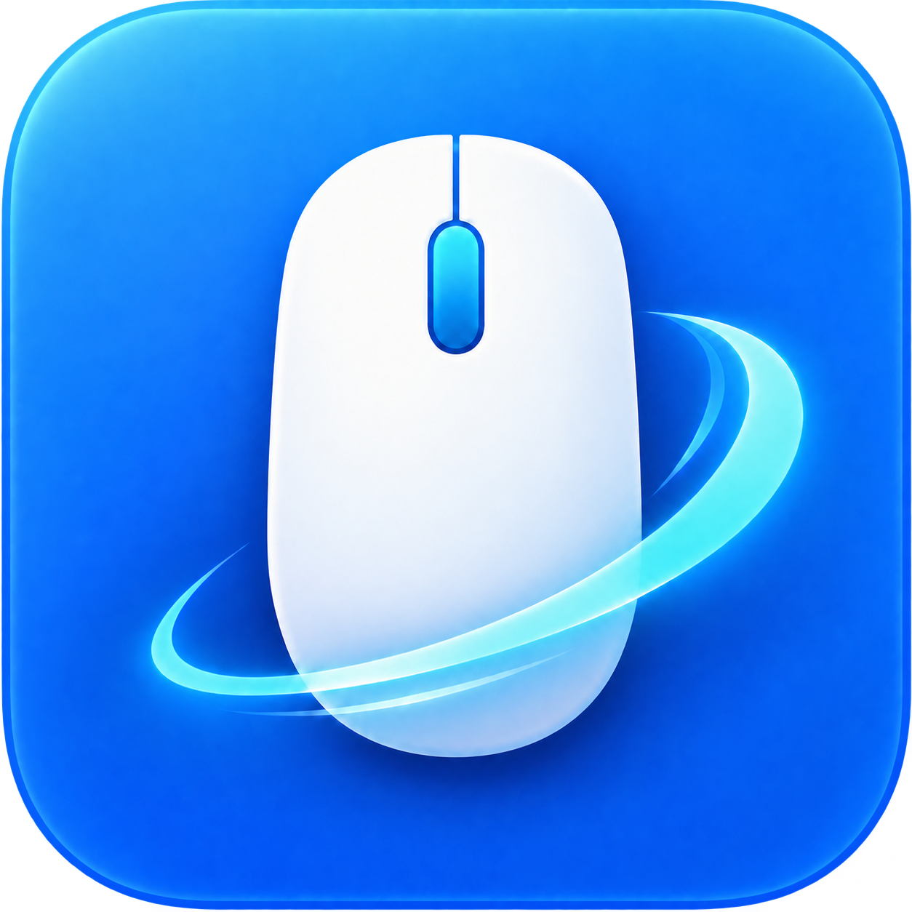
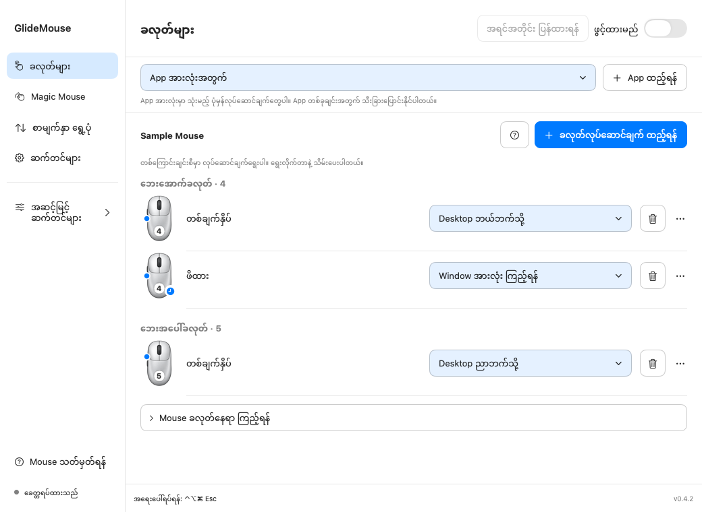
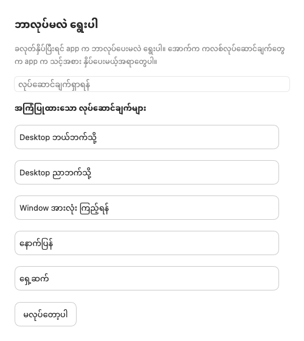
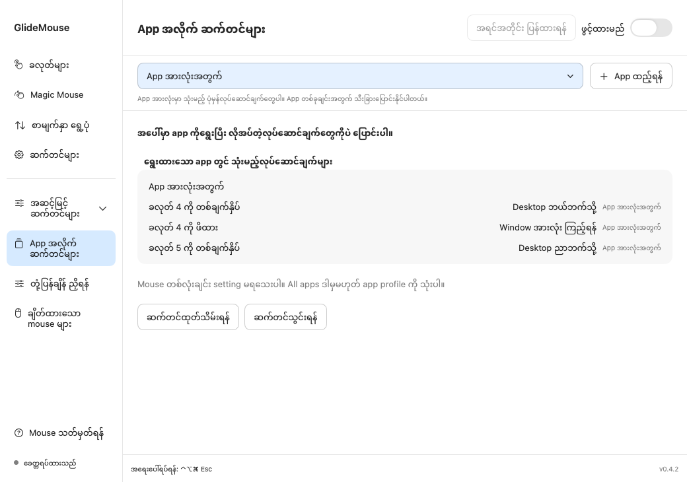
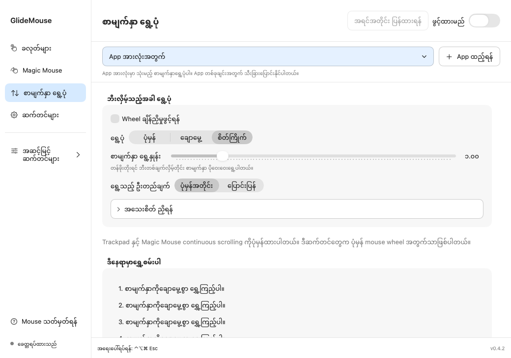
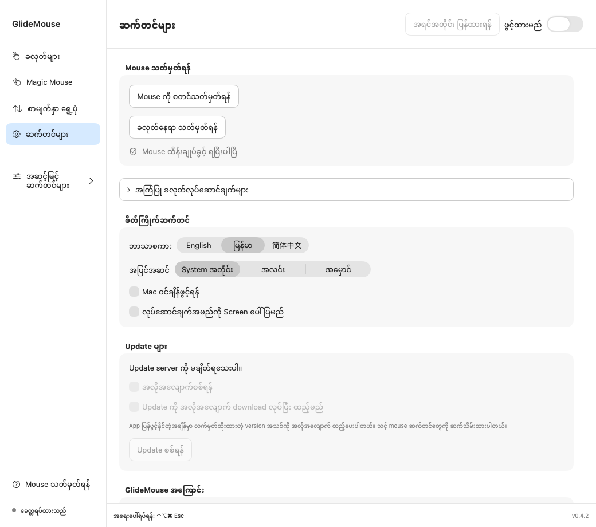

# GlideMouse အသုံးပြုနည်း

Mac မှာ mouse ခလုတ်နှိပ်ရင် ဘာလုပ်မလဲ သတ်မှတ်နိုင်ပြီး ဘီးလှည့်ပုံကိုလည်း ကိုယ်ကြိုက်သလို ချိန်နိုင်ပါတယ်။ App တစ်ခုမှာပဲ သီးခြားလုပ်ဆောင်ချက် သုံးချင်ရင်လည်း သတ်မှတ်နိုင်ပါတယ်။ Minn Khant Thu ရေးသားထားပြီး English၊ မြန်မာ၊ 简体中文 သုံးနိုင်ပါတယ်။

**[Website](https://minnkhantthuu.github.io/GlideMouse/?lang=my) · [English](README.md) · [简体中文](Docs/USER_GUIDE_ZH.md)**

**[Mac အတွက် DMG ဒေါင်းလုဒ်](https://github.com/MinnKhantThuu/GlideMouse/releases/download/v0.3.19/GlideMouse-0.3.19-developer.dmg)**

အောက်က ပုံနဲ့လမ်းညွှန်တွေက **0.4.2** အတွက်ပါ။ ဒေါင်းလုဒ်ရနိုင်တဲ့ installer တွေကို [Releases](https://github.com/MinnKhantThuu/GlideMouse/releases) မှာ ကြည့်နိုင်ပါတယ်။

## ထည့်သွင်းရန်

**macOS 14 နှင့်အထက်၊ Apple Silicon သို့မဟုတ် Intel Mac** လိုပါတယ်။ DMG ဖွင့်ပြီး GlideMouse ကို Applications ထဲ ဆွဲထည့်ပါ။ ဗားရှင်းအဟောင်း ဖွင့်ထားရင် ပိတ်ပြီးမှ အသစ်ကို ဖွင့်ပါ။ Xcode ထည့်စရာ၊ ကိုယ်တိုင် build လုပ်စရာ မလိုပါ။

**Mouse သတ်မှတ်ရန်** မှာ permission ပေးပြီး app ဆီပြန်လာကာ Refresh လုပ်ပါ။ Permission မသက်ရောက်သေးရင် app ပြန်ဖွင့်ပါ။ Applications ထဲ ရွှေ့ပြီးမှ permission ပေးပါ။

| Permission | ဘာအတွက်လဲ |
|---|---|
| Accessibility | ကိုယ်ရွေးထားတဲ့ shortcut၊ Desktop ပြောင်းတာ စတဲ့အလုပ်တွေ ပြန်လုပ်ပေးဖို့ |
| Input Monitoring | Mouse ခလုတ်နှိပ်တာနဲ့ ဘီးလှည့်တာကို သိဖို့ |

ဆက်တင်တွေကို ဒီ Mac ထဲမှာပဲ သိမ်းပါတယ်။ Keyboard နဲ့ ရိုက်တဲ့စာကို မှတ်တမ်းမသိမ်းပါ။ Update စစ်ချိန်မှာ update host ကို ချိတ်ပါတယ်။ Website သို့မဟုတ် automation လုပ်ဆောင်ချက်ရွေးထားရင် သက်ဆိုင်ရာနေရာကို ဖွင့်ပေးနိုင်ပါတယ်။

## ဘယ်စာမျက်နှာက ဘာအတွက်လဲ

| စာမျက်နှာ | လုပ်နိုင်တာ |
|---|---|
| **ခလုတ်များ** | ခလုတ်နှိပ်ပုံ ထည့်ရန်၊ တစ်ကြောင်းစီမှာ လုပ်ဆောင်ချက်ရွေးရန်၊ ဖျက်ရန် |
| **Magic Mouse** | Touch gesture ကြိုပြင်ရန်၊ လုပ်ဆောင်ချက်ရွေးရန်။ Direct-download ဗားရှင်းမှာပဲ ပါပြီး တကယ့် Magic Mouse နဲ့ စမ်းရန် ကျန်ပါသေးတယ် |
| **စာမျက်နှာရွှေ့ပုံ** | ဘီးလှည့်ပုံ၊ အမြန်နှုန်း၊ ဦးတည်ချက် ချိန်ရန် |
| **ဆက်တင်များ** | ဘာသာစကား၊ အပြင်အဆင်၊ login မှာဖွင့်ရန်၊ update၊ အကြံပြုလုပ်ဆောင်ချက်၊ backup နဲ့ developer အချက်အလက် |
| **Mouse သတ်မှတ်ရန်** | Permission စစ်ရန်၊ ခလုတ်ကို ဖမ်းပြီး နေရာသတ်မှတ်ရန် |
| **အဆင့်မြင့် → App အလိုက် ဆက်တင်များ** | ရွေးထားတဲ့ app ရဲ့ သီးခြားဆက်တင်နဲ့ ပုံမှန်လုပ်ဆောင်ချက်တွေ ကြည့်ရန် |
| **အဆင့်မြင့် → တုံ့ပြန်နှုန်း / ချိတ်ထားသော mouse များ** | အသေးစိတ်ချိန်ညှိရန်၊ mouse အချက်အလက်ကြည့်ရန် |
| **Help → ပြဿနာစစ်ဆေးရန်** | Permission နဲ့ လိုအပ်မှ နည်းပညာအချက်အလက် စစ်ရန် |

အဆင့်မြင့်ခေါင်းစဉ်တွေကို စာသားဖြစ်ဖြစ် ဘေးလွတ်နေရာဖြစ်ဖြစ် နှိပ်ပြီး ဖွင့်ပိတ်နိုင်ပါတယ်။ ပုံမှန်သုံးဖို့ မဖွင့်လည်း ရပါတယ်။

## ၁။ ခလုတ်လုပ်ဆောင်ချက် ထည့်ရန်

1. **ခလုတ်များ** ကိုဖွင့်ပါ။ အပေါ်က **App အားလုံးအတွက်** ကို အရင်ထားပါ။
2. **ခလုတ်လုပ်ဆောင်ချက် ထည့်ရန်** ကိုနှိပ်ပါ။
3. Capture အကွက်ထဲမှာ ကိုယ်သုံးမယ့် mouse ခလုတ်နှိပ်ပါ၊ ဒါမှမဟုတ် ခလုတ်နံပါတ်ကို ရွေးပါ။
4. **တစ်ချက်နှိပ်၊ နှစ်ချက်နှိပ်၊ ဖိထား** ထဲက တစ်မျိုးရွေးပါ။
5. လုပ်ဆောင်ချက်ရွေးပါ။ ပုံမှန်လုပ်ဆောင်ချက်တွေကို ရွေးတာနဲ့ သိမ်းပေးပါတယ်။ Shortcut နဲ့ target လိုတဲ့အလုပ်တွေက အသေးစိတ်ထည့်ပြီး **သိမ်းရန်** နှိပ်ရပါတယ်။
6. GlideMouse ကို ဖွင့်ထားပြီး capture အကွက်အပြင်မှာ ခလုတ်နှိပ်စမ်းပါ။

နံပါတ်တစ်ခုက mouse ရဲ့ ဘယ်နေရာမှာရှိလဲ အလိုအလျောက် အတိအကျ မသိနိုင်ပါ။ **Mouse ပေါ်က ခလုတ်ရှာရန် → ခလုတ်နေရာသတ်မှတ်ရန်** မှာ wheel နဲ့ ဘေးခလုတ်တွေကို ဖမ်းပြီး တကယ့်နေရာ အတည်ပြုပေးနိုင်ပါတယ်။ Mouse တိုင်းမှာ ခလုတ် 4 က အောက်ဘေးခလုတ် ဖြစ်မနေပါ။ တစ်ကြောင်းစီက mouse ပုံငယ်နဲ့ နံပါတ်က ဘယ်ခလုတ်အတွက်လဲ ပြပေးပါတယ်။ ပုံကြီးကို လိုမှဖွင့်ကြည့်နိုင်ပါတယ်။

| နမူနာ နှိပ်ပုံ | လုပ်ဆောင်ချက် |
|---|---|
| အောက်ဘေးခလုတ် တစ်ချက်နှိပ် | Desktop ဘယ်ဘက်သို့ |
| အပေါ်ဘေးခလုတ် တစ်ချက်နှိပ် | Desktop ညာဘက်သို့ |
| အောက်ဘေးခလုတ် ဖိထား | Mission Control — Window အားလုံးကြည့်ရန် |

Desktop ပြောင်းဖို့ macOS မှာ Space တစ်ခုထက်ပို ရှိရပါမယ်။ Keyboard → Keyboard Shortcuts → Mission Control မှာ Control–Left/Right ဖွင့်ထားပြီး keyboard ကနေ အရင်စမ်းပါ။

**နှိပ်ပုံနဲ့ လုပ်ဆောင်ချက်က မတူပါ။** စာရင်းဘယ်ဘက်က “နှစ်ချက်နှိပ်” ဆိုတာ ကိုယ်က mouse ကို ဘယ်လိုနှိပ်မလဲ ဆိုတာပါ။ Action ထဲက “ဘယ်ကလစ်နှစ်ချက်လုပ်မည်” ကတော့ app က ပြန်လုပ်ပေးမယ့်အလုပ်ပါ။ ဘေးခလုတ်ကို တစ်ချက်နှိပ်ပြီး ဘယ်ကလစ်နှစ်ချက် လုပ်ခိုင်းလို့ရပါတယ်။

**ဘယ်/ညာခလုတ် 1 နဲ့ 2** ကိုလည်း နှစ်ချက်နှိပ်၊ ဖိထား သတ်မှတ်နိုင်ပါတယ်။ ပုံမှန် click နဲ့ drag ဆက်သုံးနိုင်ပါတယ်။ နှစ်ချက်နှိပ် သတ်မှတ်ရင် တစ်ချက်လား နှစ်ချက်လား ခွဲဖို့ အချိန်တိုလေး စောင့်ရပါတယ်။ ချက်ချင်းတုံ့ပြန်ဖို့လိုတဲ့ခလုတ်မှာ မလိုဘဲ မထည့်ပါနဲ့။

## ၂။ ပြောင်းရန်၊ ဖျက်ရန်

လုပ်ဆောင်ချက်ရွေးတဲ့ အကွက်တစ်ခုလုံးကို နှိပ်လို့ရပါတယ်။ တခြားလုပ်ဆောင်ချက်ရွေးတာနဲ့ သိမ်းသွားပါတယ်။ နာမည်နဲ့ ရှာနိုင်ပါတယ်။

ဖျက်ချင်ရင် အဲဒီတစ်ကြောင်းက **အမှိုက်ပုံးခလုတ်** နှိပ်ပါ။ တစ်ချက်နှိပ်ကို ဖျက်တာက ဖိထားနဲ့ နှစ်ချက်နှိပ်ကို မဖျက်ပါ။ မှားသွားရင် **Undo** နဲ့ပြန်ယူပါ။ **…** မှာ အသေးစိတ်ပြင်ရန်၊ အဆင့်မြင့်သတ်မှတ်ရန်နဲ့ app သီးခြားဆက်တင်ကို ပုံမှန်အတိုင်း ပြန်ထားရန် ပါပါတယ်။

အသံကျယ်စေချင်ရင် **အသံကျယ်စေရန်**၊ လျှော့ချင်ရင် **အသံလျှော့ရန်** ရွေးပါ။ **အသံပိတ် / ပြန်ဖွင့်ရန်** က mute ပြောင်းပေးပါတယ်။ **App ရှာဖွင့်ရန် (Spotlight)** က Spotlight search ဖွင့်ပေးပြီး **Screenshot ရိုက်ရန် ကိရိယာများဖွင့်မည်** က macOS screenshot toolbar ဖွင့်ပေးပါတယ်။

## ၃။ App တစ်ခုမှာပဲ သီးခြားသုံးရန်

**App အားလုံးအတွက်** က ပုံမှန်ဆက်တင်ပါ။ App တိုင်းကို ထည့်စရာ မလိုပါ။

1. အပေါ်က **App ထည့်ရန်** နှိပ်ပြီး သုံးချင်တဲ့ app ကိုရွေးပါ။
2. Scope အကွက်မှာ အဲဒီ app နာမည်ပေါ်နေကြောင်း စစ်ပါ။
3. လိုတဲ့တစ်ကြောင်းရဲ့ လုပ်ဆောင်ချက်ကို ပြောင်းပါ။ အဲဒီ app အတွက်ပဲ သိမ်းသွားပါတယ်။
4. အဲဒီ app ကို ရှေ့ဆုံးဖွင့်ထားပြီး စမ်းပါ။

**App အားလုံးမှ** ဆိုရင် ပုံမှန်ဆက်တင်ကို ယူသုံးနေတာပါ။ တခြား action ရွေးလိုက်ရင် ဒီ app အတွက် သီးခြားဖြစ်သွားပါတယ်။ မပြောင်းတဲ့ခလုတ်တွေက ပုံမှန်အတိုင်း ဆက်သုံးပါတယ်။ ဥပမာ ဘေးခလုတ်က ပုံမှန်ဆို Desktop ပြောင်းပြီး Safari ရှေ့ဆုံးဖြစ်နေချိန်မှာတော့ နောက်ပြန် သွားစေနိုင်ပါတယ်။

ရွေးထားတဲ့ app ကို **App ဖြုတ်ရန်** နဲ့ ဖြုတ်နိုင်ပါတယ်။ GlideMouse ထဲက ဆက်တင်ကိုပဲ ဖြုတ်တာပါ၊ တကယ့် app ကို uninstall မလုပ်ပါ။ ပုံမှန်လုပ်ဆောင်ချက်တွေ ပြန်သက်ရောက်ပြီး Undo နဲ့ပြန်ယူနိုင်ပါတယ်။ App အားလုံးကနေ ယူသုံးတဲ့တစ်ကြောင်းကို ဒီ app ရဲ့ကိုယ်ပိုင် action လို ဖျက်လို့မရပါ။ ပုံမှန် action ဖျက်ချင်ရင် App အားလုံးကိုရွေးပါ၊ ဒီ app မှာပဲ ပြောင်းချင်ရင် အခြား action ရွေးပါ။

## ၄။ ဘီးလှည့်ပုံ ချိန်ရန်

**ပုံမှန်** သို့မဟုတ် **ချောမွေ့** ကို အရင်စမ်းပါ။ အမြန်နှုန်းနဲ့ ဦးတည်ချက်ကို အရင်ချိန်ပြီး လိုမှ အသေးစိတ်ဖွင့်ပါ။

| ဆက်တင် | အဓိပ္ပာယ် |
|---|---|
| အမြန်နှုန်း | ဘီးတစ်ဆင့်လှည့်ရင် စာမျက်နှာ ဘယ်လောက်ရွေ့မလဲ |
| ဦးတည်ချက် | ဘီးလှည့်ရာနဲ့ တူတူလား၊ ပြောင်းပြန်လား |
| ချောမွေ့မှု | ဘီးတစ်ဆင့်ကို တဖြည်းဖြည်း ဘယ်လောက်ရွေ့မလဲ |
| Momentum | ဘီးရပ်ပြီးနောက် ခဏဆက်ရွေ့မလား |
| Acceleration | မြန်မြန်လှည့်ရင် ပိုဝေးဝေးရွေ့မလား။ သုညထားရင် မတိုးပါ |
| Shift + ဘီး | ဘေးတိုက်ရွှေ့ရန် |
| Control + ဘီး | နည်းနည်းစီရွှေ့ရန် |
| Option + ဘီး | လက်ရှိ app ရဲ့ shortcut နဲ့ zoom လုပ်ရန် |

App တစ်ခုရွေးထားရင် **ဒီ app မှာ scroll သီးခြားသုံးရန်** ဖွင့်ပြီးမှ ပြင်ပါ။ မဖွင့်ထားရင် ပုံမှန်အတိုင်း ယူသုံးပါတယ်။ ဒီဆက်တင်တွေက ပုံမှန် mouse wheel အတွက်ပါ။ Trackpad နဲ့ Magic Mouse ရဲ့ continuous scroll က native အတိုင်း ဆက်အလုပ်လုပ်ပါတယ်။

## ၅။ Shortcut နဲ့ အဆင့်မြင့်လုပ်ဆောင်ချက်

**Keyboard shortcut** ရွေးပြီး Record shortcut အကွက်ကိုနှိပ်ပါ။ ကိုယ်သုံးမယ့် shortcut တစ်ကြိမ်နှိပ်ပြီး အသေးစိတ်စာမျက်နှာမှာ သိမ်းပါ။ Keyboard ကနေ အဲဒီ app မှာ အလုပ်လုပ်ကြောင်း အရင်စစ်ပါ။ Capture အကွက်အပြင်က သတ်မှတ်ပြီးသား mouse action တွေ ဆက်အလုပ်လုပ်ပါတယ်။

App၊ folder၊ website ဖွင့်တဲ့အလုပ်တွေက target ထည့်ရပါတယ်။ Shell နဲ့ Apple Shortcuts က ကိုယ်တိုင်ခွင့်ပြုပြီးမှ သုံးရတဲ့ အဆင့်မြင့်လုပ်ဆောင်ချက်ပါ။ Import လုပ်လာတဲ့ command တွေကို စစ်ပြီးမှ ဖွင့်နိုင်ပါတယ်။ ဖိထားပြီးရွှေ့တာ၊ ဖိထားပြီးဘီးလှည့်တာနဲ့ modifier တွေကို **အဆင့်မြင့်သတ်မှတ်ရန်** မှာ ထည့်နိုင်ပါတယ်။

## ၆။ ဆက်တင်၊ Backup၊ အကူအညီ

- ဘာသာစကားနဲ့ အလင်း/အမှောင် ပြောင်းနိုင်ပါတယ်။ သတ်မှတ်ထားတဲ့ action တွေ မပြောင်းပါ။
- Login ဝင်ချိန် app ဖွင့်ရန်နဲ့ action နာမည် screen ပေါ်ပြရန်ကို ကိုယ်လိုမှဖွင့်ပါ။
- Settings ထဲက **အကြံပြု ခလုတ်လုပ်ဆောင်ချက်များ** က ရွေးချယ်စရာပါ။ ဖွင့်ကြည့်ရုံနဲ့ မထည့်ပါ။ Preview ကို စစ်ပြီး Apply နှိပ်မှ ထည့်ပါတယ်။ ကိုယ့်ဘာသာ action ထည့်ထားရင် မသုံးလည်းရပါတယ်။
- Update ကို ကိုယ်တိုင်စစ်နိုင်သလို အလိုအလျောက်စစ်/ဒေါင်းလုဒ်လည်း လုပ်နိုင်ပါတယ်။ Signed release အသစ်ကို feed မှာ တင်ထားမှ ရပါတယ်။ Source ပြောင်းရုံနဲ့ app မပြောင်းပါ။ Store ဗားရှင်းက App Store ကနေ update ရပါတယ်။
- Export က ဆက်တင် backup သိမ်းပေးပါတယ်။ Import မှာ Merge/Replace ကို အရင်စစ်နိုင်ပါတယ်။ Replace လုပ်ရင် engine ခေတ္တပိတ်ပြီး Merge က မကိုက်တဲ့ rule တွေကို အပေါ်ကနေ တိတ်တိတ်မရေးပါ။
- About မှာ developer၊ email၊ app website နဲ့ support link ပါပါတယ်။

**အရေးပေါ်ရပ်ရန် — ⌃⌥⌘ Esc** (Control + Option + Command + Escape)။ Menu bar ကနေ Pause လည်းရပါတယ်။

ခလုတ်များထဲက **?** မှာ offline animation လမ်းညွှန်ရှိပြီး [website](https://minnkhantthuu.github.io/GlideMouse/?lang=my#mouse-guide) မှာလည်း ကြည့်နိုင်ပါတယ်။ ကြည့်ရုံနဲ့ ဆက်တင်မပြောင်းပါ၊ Mac ကို တကယ်မထိန်းချုပ်ပါ။ မိတ်ဆက် video မှာ နမူနာ app screen၊ English စာသားနဲ့ ကိုယ်ပိုင် music သုံးထားပါတယ်။ အရင် tutorial video တွေက ဗားရှင်းအဟောင်းရဲ့ UI ကို ပြထားတာပါ။

## အလုပ်မလုပ်ရင်

Permission နှစ်ခု၊ engine ဖွင့်ထားတာနဲ့ mouse ချိတ်ထားတာကို စစ်ပါ။ ခလုတ်မှားနေရင် ပြန်ဖမ်းပါ။ Desktop မပြောင်းရင် Control–Left/Right ကို keyboard ကနေ စမ်းပါ။ App တစ်ခုမှာပဲ မရရင် scope နဲ့ override ကိုစစ်ပါ။ Click နှေးရင် double/hold ဆက်တင်နဲ့ timing ကိုစစ်ပါ။ Mouse utility တခြားတစ်ခုနဲ့ ယှဉ်စမ်းချိန် အဲဒီတစ်ခုကို ခေတ္တ pause လုပ်ပါ။

Help → ပြဿနာစစ်ဆေးရန်ကို သုံးနိုင်ပါတယ်။ နည်းပညာအချက်အလက်ကို လိုမှဖွင့်ပါ။ Diagnostics မျှဝေမယ်ဆို အရင်စစ်ပါ။ [GitHub issue](https://github.com/MinnKhantThuu/GlideMouse/issues) တင်ရင် version၊ macOS၊ mouse model၊ scope နဲ့ ပြန်ဖြစ်အောင်လုပ်တဲ့အဆင့်တွေ ထည့်ပေးပါ။ လျှို့ဝှက်ဖိုင်နဲ့ credential မပို့ပါနဲ့။

## သုံးနိုင်မှုနဲ့ ဗားရှင်းကွာခြားချက်

Direct-download မှာ Magic Mouse tap၊ swipe၊ pinch/spread၊ drag၊ dragging နဲ့ scroll၊ resting fingers၊ modifier တွေ ကြိုသတ်မှတ်နိုင်ပါတယ်။ **တကယ့် Magic Mouse နဲ့ စမ်းရန် ကျန်ပါသေးတယ်။** Native continuous Desktop swipe၊ magnify နဲ့ Smart Zoom မရပါ။ Mouse မော်ဒယ်တစ်ခုချင်းအတွက် button/wheel ခွဲသတ်မှတ်တာလည်း မရသေးပါ။ [Compatibility](Docs/COMPATIBILITY.md) နဲ့ [Magic Mouse လမ်းညွှန်](Docs/guides/MAGIC_MOUSE.md) ကို ကြည့်ပါ။

Sandboxed Store ဗားရှင်းမှာ ပုံမှန်ခလုတ်၊ click/double/hold၊ shortcut၊ Desktop/Mission Control၊ wheel၊ URL နဲ့ app အလိုက်ဆက်တင် ပါပါတယ်။ Private touch gesture၊ media/brightness injection၊ command၊ app/folder target၊ Sparkle နဲ့ donation ခလုတ် မပါပါ။ [Store အချက်အလက်](Docs/MAC_APP_STORE.md) ကို ကြည့်နိုင်ပါတယ်။

## Developer

**Minn Khant Thu** · [Website](https://minnkhantthu.up.railway.app/) · [Email](mailto:minnkhantthu.ucsy@gmail.com) · [Buy Me a Coffee](https://buymeacoffee.com/minnkhantthu)

[MIT License](LICENSE) · [Third-party notices](THIRD_PARTY_NOTICES.md) · [Build လုပ်ရန် / ပူးပေါင်းရန်](CONTRIBUTING.md)
